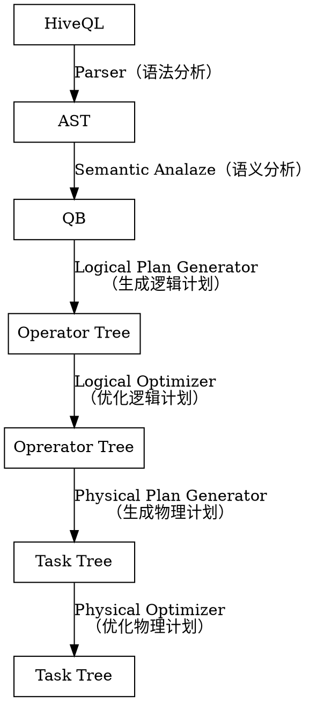

# HiveQL parse #

## 整体过程 ##



Hive将SQL转化为MapReduce任务的编译过程分为六个阶段：

1. Antlr定义SQL的语法规则，完成SQL词法，语法解析，将SQL转化为抽象语法树AST Tree
2. 遍历AST Tree，抽象出查询的基本组成单元QueryBlock
3. 遍历QueryBlock，翻译为执行操作树OperatorTree
4. 逻辑层优化器进行OperatorTree变换，合并不必要的ReduceSinkOperator，减少shuffle数据量
5. 遍历OperatorTree，翻译为MapReduce任务
6. 物理层优化器进行MapReduce任务的变换，生成最终的执行计划

## 代码流程 ##

```dot
digraph G {
    compound=true;
    node [shape=record];
    phase [
      shape=plaintext,
      label=<
          <table color="#ffffff" border="0" cellborder="1" cellspacing="0">
          <tr><td bgcolor="#f06292" port="parse"><font color="#ffffff">词法分析、语法分析</font></td></tr>
          <tr><td bgcolor="#ff6d00" port="sem"><font color="#ffffff">语义分析</font></td></tr>
          <tr><td bgcolor="#448aff" port="logic"><font color="#ffffff">生成逻辑计划</font></td></tr>
          <tr><td bgcolor="#00accf" port="logicopt"><font color="#ffffff">进行逻辑优化</font></td></tr>
          <tr><td bgcolor="#7cb342" port="physic"><font color="#ffffff">生成物理计划</font></td></tr>
          <tr><td bgcolor="#ab47bc" port="physicopt"><font color="#ffffff">进行物理优化</font></td></tr>
          </table>
      >
    ];
        run [label="Driver.run()"];
        subgraph cluster01 {
            label="Driver.runInternal";
            node11 [
                shape=record,
                label="{
                    HookRunner.runPreDriverHooks()\l
                    |<compileInternal>compileInternal()\l
                    |execute()\l
                    |HookRunner.runPostDriverHooks()\l
                }"
            ];
        }
        subgraph cluster02 {
            label="Driver.compile()";
            node21 [
                shape=plaintext,
                label=<
                    <table border="0" cellborder="1" cellspacing="0">
                        <tr><td align="left">HookRunner.runBeforeParseHook()</td></tr>
                        <tr><td align="left" port="parse" bgcolor="#f06292"><font color="#ffffff">ParseUtils.parse()</font></td></tr>
                        <tr><td align="left">HookRunner.runAfterParseHook()</td></tr>
                        <tr><td align="left">HookRunner.runBeforeCompileHook()</td></tr>
                        <tr><td align="left">HookRunner.runPreAnalyzeHooks()</td></tr>
                        <tr><td align="left" port="semAnalyze">BaseSemanticAnalyzer.analyze()</td></tr>
                        <tr><td align="left">HookRunner.runPostAnalyzeHooks()</td></tr>
                        <tr><td align="left">BaseSemanticAnalyzer.validate()</td></tr>
                        <tr><td align="left">HookRunner.runAfterCompilationHook()</td></tr>
                    </table>
                >
            ];
        }
        subgraph cluster03 {
            label="SemanticAnalyze.analyzeInternal()";
            node31 [
                shape=plaintext,
                label=<
                    <table border="0" cellborder="1" cellspacing="0">
                    <tr><td align="left">1. 从抽象语法树生成Resolved Parse Tree</td></tr>
                    <tr><td align="left">processPositionAlias() // 处理位置符号</td></tr>
                    <tr><td align="left" port="resolve">genResolvedParseTree()</td></tr>
                    <tr><td align="left">2. 从Resolved Parse Tree生成操作符树</td></tr>
                    <tr><td align="left" bgcolor="#448aff" port="genop"><font color="#ffffff">genOPTree()</font></td></tr>
                    <tr><td align="left">3. 推断结果模式</td></tr>
                    <tr><td align="left">convertRowSchemaToViewSchema()</td></tr>
                    <tr><td align="left">4. 为优化器和物理编译器生成解析上下文</td></tr>
                    <tr><td align="left">5. 处理视图创建命令</td></tr>
                    <tr><td align="left">6. 分析表访问情况</td></tr>
                    <tr><td align="left">TableAccessAnalyzer.analyzeTableAccess()</td></tr>
                    <tr><td align="left">7. 进行逻辑优化</td></tr>
                    <tr><td align="left" bgcolor="#00accf" port="opt"><font color="#ffffff">Optimizer.optimize()</font></td></tr>
                    <tr><td align="left">8. 分析列访问情况</td></tr>
                    <tr><td align="left">ColumnAccessAnalyzer.analyzeColumnAccess()</td></tr>
                    <tr><td align="left">9. 优化物理操作符树，编译到目标执行引擎上（MR、TEZ等）</td></tr>
                    <tr><td align="left" port="taskcompile">TaskCompiler.compile()</td></tr>
                    </table>
                >
            ];
        }
        subgraph cluster04 {
            label="SemanticAnalyzer.genResolvedParseTree()";
            node41 [
                shape=plaintext,
                label=<
                    <table border="0" cellborder="1" cellspacing="0">
                        <tr><td align="left">1. 分析并处理位置符号（已在SemanticAnalyze.analyze中完成）</td></tr>
                        <tr><td align="left">2. 分析建表命令</td></tr>
                        <tr><td align="left">3. 分析视图创建命令</td></tr>
                        <tr><td align="left">4. 继续分析子结点</td></tr>
                        <tr><td align="left" bgcolor="#ff6d00" port="dophase1"><font color="#ffffff">doPhase1()</font></td></tr>
                        <tr><td align="left">5. Resolve Parse Tree</td></tr>
                        <tr><td align="left">getMetaData()</td></tr>
                    </table>
                >
            ];
        }
        subgraph cluster05 {
            label="TaskCompiler.compile()"
            node51 [
                shape=plaintext,
                label=<
                    <table border="0" cellborder="1" cellspacing="0">
                        <tr><td bgcolor="#7cb342" port="gentt"><font color="#ffffff">generateTaskTree()</font></td></tr>
                        <tr><td bgcolor="#ab47bc" port="opttt"><font color="#ffffff">optimizeTaskPlan()</font></td></tr>
                    </table>
                >
            ];
        };

    run -> node11[lhead=cluster01];
    node11:compileInternal -> node21[lhead=cluster02];
    phase:parse:w -> node21:parse:e[color="#f06292"];
    node21:semAnalyze -> node31[lhead=cluster03];
    node31:resolve:e -> node41[lhead=cluster04];
    phase:sem:w -> node41:dophase1:e[color="#ff6d00"];
    phase:logic:w -> node31:genop:e[color="#448aff"];
    phase:logicopt:w -> node31:opt:e[color="#00accf"];
    node31:taskcompile -> node51[lhead=cluster05];
    phase:physic:w -> node51:gentt:e[color="#7cd342"];
    phase:physicopt:w -> node51:opttt:e[color="#ab47bc"];
    node11->node21->node31->node41->node51[style="invis"];
}
```



SQL编译相关代码都在包`org.apache.hadoop.hive.ql.parse`中，项目使用时添加下述依赖即可。

```gradle
// https://mvnrepository.com/artifact/org.apache.hive/hive-exec
compile group: 'org.apache.hive', name: 'hive-exec', version: '2.3.4', classifier: 'core'
```

## 语法分析 ##

hive使用antrl完成sql的词法分析、语法分析，将输入SQL转换为抽象语法树（AST，Abstract Syntax Tree），具体实现在`ParseDriver.parse()`中。

```Java
public ASTNode parse(String command, Context ctx, String viewFullyQualifiedName) throws ParseException {
    //...
    HiveLexerX lexer = new HiveLexerX(new ANTLRNoCaseStringStream(command));
    TokenRewriteStream tokens = new TokenRewriteStream(lexer);
    HiveParser parser = new HiveParser(tokens);
    parser.setTreeAdaptor(adaptor);
    HiveParser.statement_return r = parser.statement();
    ASTNode tree = (ASTNode) r.getTree();
    return tree;
}
```

hive的语法文件包含词法规则HiveLexer.g和语法规则的4个文件SelectClauseParser.g，FromClauseParser.g，IdentifiersParser.g，HiveParser.g。

AST的一些常用操作：

+ `ast.getToken().getType()`：获取结点Token，结点的所有类型值保存在HiveParser，形式为`HiveParser.TOK_XXX`。
+ `(ASTNode)ast.getChild(i)`：获取第i个子结点。

## 语义分析 ##

AST非常复杂，不够结构化，不方便直接翻译为MapReduce任务，AST转化为QueryBlock就是将SQL进一步抽象和结构化。

QueryBlock是一条SQL最基本的组成单元，包括三个部分：输入源，计算过程，输出，即一个QueryBlock就是一个子查询。

+ `getSubqAliases()`：

语义分析功能由BaseSemanticAnalyzer及其子类实现。AST生成QueryBlock的过程就是深度优先遍历AST，根据结点Token将信息保存到不同的属性中。主要包含一下几个过程：

+ `TOK_QUERY`：创建QueryBlock对象，循环递归子结点
+ `TOK_FROM`：将表名的语法部分保存到QueryBlock对象的`aliasToTabs`属性中
+ `TOK_INSERT`：循环递归子结点
+ `TOK_DESTINATION`：将输出目标的语法部分保存在`QBParseInfo`对象的`nameToDest`属性中
+ `TOK_SELECT`：分别将查询表达式的语法部分保存在`destToSelExpr`、`destToAggregationExprs`、`destToDistinctFuncExprs`三个属性中
+ `TOK_WHERE`：将Where部分的语法保存在`QBParseInfo`对象的`destToWhereExpr`属性中

## 生成逻辑计划 ##

Hive最终生成的MapReduce任务，Map阶段和Reduce阶段均由OperatorTree组成。

逻辑操作符，就是在Map阶段或者Reduce阶段完成单一特定的操作。
基本的操作符如下所示：

+ `TableScanOperator`：从MapReduce框架的Map接口读取原始输入表的数据，控制扫描表的数据行数，标记是从原表中取数据
+ `JoinOperator`：完成join操作
+ `FilterOperator`：完成过滤操作
+ `ReduceSinkOperator`：将Map端的字段组合序列化为Reduce Key/value, Partition Key，只可能出现在Map阶段，同时也标志着Hive生成的MapReduce程序中Map阶段的结束
+ `FileSinkOperator`：将数据写入HDFS，hive中所有查询的数据均会保存在HDFS临时的文件中，无论是中间的子查询还是查询最终的结果，Insert语句最终会将数据写入表所在的HDFS目录下

Operator在Map或Reduce阶段内的数据传递都是一个流式的过程，每一个Operator对一行数据完成操作后之后将数据传递给childOperator计算。

Operator类的主要属性和方法如下：

+ `RowSchema`：表示Operator的输出字段
+ `InputObjInspector`、`outputObjInspector`：解析输入输出字段
+ `processOp`接收父Operator传递的数据，`forward`将处理好的数据传递给子Operator处理
+ Hive每一行数据经过一个Operator处理之后，会对字段重新编号，`colExprMap`记录每个表达式经过当前Operator处理前后的名称对应关系，在下一个阶段逻辑优化阶段用来回溯字段名
+ 由于Hive的MapReduce程序是一个动态的程序，即不确定一个MapReduce Job会进行什么运算，可能是Join，也可能是GroupBy，所以Operator将所有运行时需要的参数保存在`OperatorDesc`中，`OperatorDesc`在提交任务前序列化到HDFS上，在MapReduce任务执行前从HDFS读取并反序列化。Map阶段OperatorTree在HDFS上的位置在`Job.getConf("hive.exec.plan") + "/map.xml"`

对子查询递归调用`genPlan()`，返回操作符树的根结点。

对于每个子查询，`genPlan()`自底向上创建Oprator（FROM->WHERE->GROUPBY->ORDERBY->SELECT）。

对于FROM从句，对每个来源表生成TableScanOperator，然后调用`genLatervalView()`和`genJoinPlan()`。

调用`genBodyPlan()`来处理WHERE-GROUPBY-ORDERBY-SELECT从句。

+ 对WHERE从句调用`genFilterPlan()`
+ 对map侧的部分聚合调用`genGroupByPlanMapAgg1MR/2MR()`
+ 对reduce侧的聚合调用`genGroupByPlan1MR/2MR()`
+ 对SELECT从句调用`genSelectPlan()`
+ 对map/reduce阶段的边界调用`genReduceSink()`
+ 调用`genFileSink()`存储中间结果

QueryBlock生成Operator Tree就是遍历上一个过程中生成的QB和QBParseInfo对象的保存语法的属性，包含如下几个步骤：

+ `QB.aliasToSubq`：有子查询，递归调用
+ `QB.aliasToTabs`：生成TableScanOperator
+ `QBParseInfo.joinExpr`：生成QBJoinTree，包含`ReduceSinkOperator`和`JoinOperator`
+ `QBParseInfo.destToWhereExpr`：生成`FilterOperator`
+ `QBParseInfo.destToGroupby`：生成`ReduceSinkOperator`和`GroupByOperator`
+ `QBParseInfo.destToOrderby`：生成`ReduceSinkOperator`和`ExtractOperator`

由于Join/GroupBy/OrderBy均需要在Reduce阶段完成，所以在生成相应操作的Operator之前都会先生成一个ReduceSinkOperator，将字段组合并序列化为Reduce Key/value, Partition Key

## 优化逻辑计划 ##

优化器是一组操作符树的转化规则，转化基于树的正则模式和Worker/Dispatcher框架实现。

逻辑优化在Optimizer类中实现：

```Java
private List<Transform> transformations; // transformations是转化的数组，
public ParseContext optimize() throws SemanticException {
for (Transform t : transformations) {
    t.beginPerfLogging();
    pctx = t.transform(pctx);
    t.endPerfLogging(t.toString());
}
return pctx;
}
```

逻辑层优化主要是通过变换OperatorTree，合并操作符，达到减少MapReduce Job，减少Shuffle数据量的目的，进而优化性能。主要分为两种，一种是合并即一个job做尽可能多的事，一种是减少shuffle数量，甚至不做reduce。

|名称|作用|
|---|---|
| ReduceSinkDeDuplication | 合并线性相连两个ReduceSinkOperator，当较前的ReduceSinkOperator的Key和PartitionKey完全包含较后的ReduceSinkOperator的Key和PartitionKey且排序顺序一致时进行优化 |
| PredicatePushDown | 谓词前置优化器将OperatorTree中的FilterOperator提前到TableScanOperator之后 |
| CorrelationOptimizer | 利用查询中的相关性，合并有相关性的Job |
| SimpleFetchOptimizer | 优化没有GroupBy表达式的聚合查询 |
| MapJoinProcessor | MapJoin优化 |
| UnionProcessor | |
| JoinReorder | |
| BucketMapJoinOptimizer | BucketMapJoin |
| GroupByOptimizer | Map端聚合 |
| ColumnPruner | 字段剪枝 |
| PartitionPruner | |
| SamplePruner | |
| NonBlockingOpDeDupProc | 合并两个连续的SelectOperator或FilterOperator为一个Operator |

## 生成物理计划 ##

`genMapRedWorks()`接收QB、QBParseInfo和Operator Tree，然后遍历Operator Tree基于Worker/Dispatcher框架生成MapReduce任务的有向无环图。

Operator Tree转化为MapReduce Job的过程分为下面几个阶段：

+ 对输出表生成MoveTask
+ 从OperatorTree的其中一个根节点向下深度优先遍历
+ ReduceSinkOperator标识Map/Reduce的界限，多个Job间的界限
+ 遍历其他根节点，遇过碰到JoinOperator合并MapReduceTask
+ 生成StatTask更新元数据
+ 剪断Map与Reduce间的Operator的关系

MapReduce任务类型如下：

+ MapRedTask
+ ConditionalTask
+ FetchTask
+ MoveTask
+ DDLTask
+ CounterTask

## 优化物理计划 ##

物理层优化器主要包含：

|名称|作用|
|---|---|
|Vectorizer||
|SortMergeJoinResolver|与bucket配合，类似于归并排序|
|SamplingOptimizer|并行order by优化器|
|CommonJoinResolver + MapJoinResolver|MapJoin优化器|

MapJoin优化器就是在Map阶段将小表读入内存，顺序扫描大表完成Join。MapJoin分为两个阶段：

1. 通过MapReduce Local Task，将小表读入内存，生成HashTableFiles上传至Distributed Cache中
2. MapReduce Job在Map阶段，每个Mapper从Distributed Cache读取HashTableFiles到内存中，顺序扫描大表，在Map阶段直接进行Join，将数据传递给下一个MapReduce任务

如果Join的两张表一张表是临时表，就会生成一个ConditionalTask，在运行期间判断是否使用MapJoin。

CommonJoinResolver优化器就是将CommonJoin转化为MapJoin，转化过程如下

+ 深度优先遍历Task Tree
+ 找到JoinOperator，判断左右表数据量大小
+ 对与小表 + 大表 => MapJoinTask，对于小/大表 + 中间表 => ConditionalTask

MapJoinResolver优化器遍历Task Tree，将所有有local work的MapReduceTask拆成两个Task。
