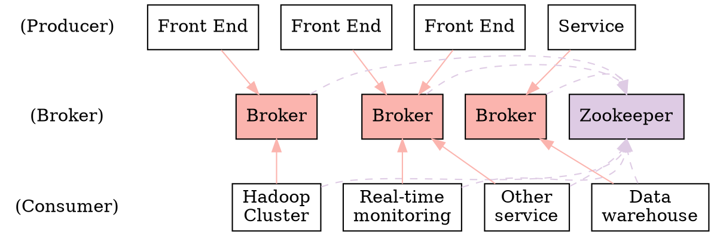
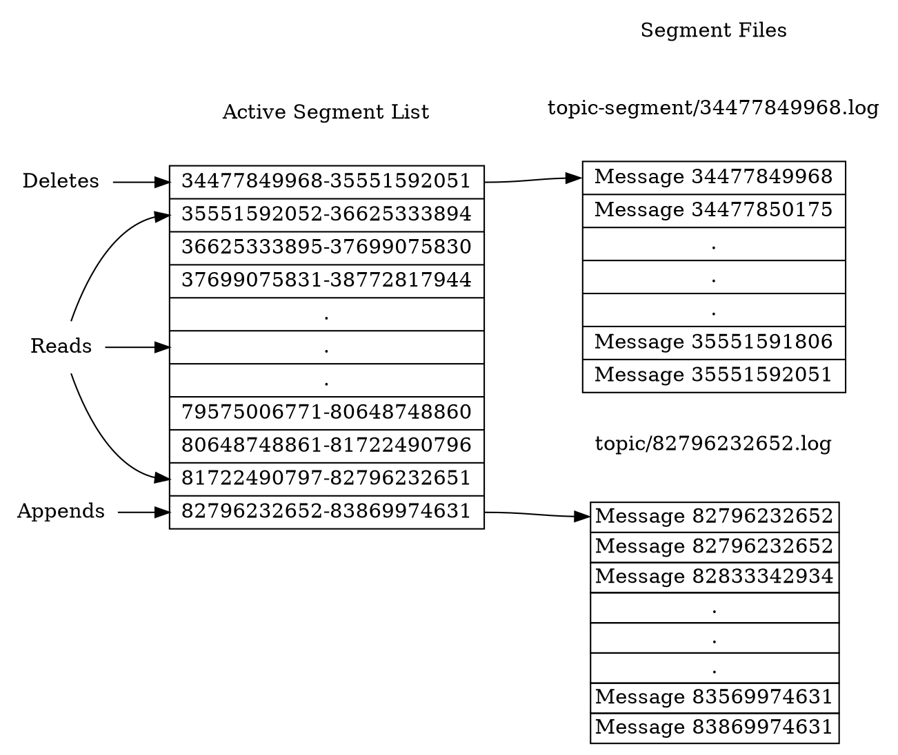

# Kafka #

## 架构 ##



一个典型的Kafka集群包含若干Producer、若干Broker、若干Consumer Group以及一个Zookeeper集群，Kafka通过Zookeeper管理集群配置，选举leader，以及在Consumer Group发生变化时进行rebalance。Producer使用push模式将消息发布到Broker，Consumer使用pull模式从Broker订阅并消费消息。

术语：

+ Broker：Kafka集群包含一个或多个服务器，这种服务器被称为Broker
+ Topic：每条发布到Kafka集群的消息都有一个类别，这个类别被称为Topic
+ Partition：Parition是物理上的概念，每个Topic包含一个或多个Partition
+ Producer：消息生产者，负责发布消息到Kafka Broker
+ Consumer：消息消费者，从Kafka Broker读取消息的客户端
+ Consumer Group：每个Consumer属于一个特定的Consumer Group

## Topic和Partition ##



Topic在逻辑上可以被认为是一个队列，每条消息都必须指定它的Topic，可以简单理解为必须指明把这条消息放进哪个队列里。为了使得Kafka的吞吐率可以线性提高，物理上把Topic分成一个或多个Partition，每个Partition在物理上对应一个文件夹（名称为topic-partition），该文件夹下存储这个Partition的所有日志文件和索引文件。

Partition包含的消息被分成多个segment，每个segment对应一个日志文件，文件名以segment中第一条消息的offset命名并以`.log`为后缀，日志文件内是一串log entry，log entry包含一个4字节整数N（消息字节大小+5），1个字节的Magic Value，4个字节的CRC，其后跟N个字节的消息体。消息由一个64位整数标识，称为offset，表示这条消息的开始位置在该分区所有消息中的位置，以字节为单位。

索引文件以`.index`为后缀，内容为每个segment包含的log entry的offset范围。

（二进制文件，通过`kafka.tools.DumpLogSegments`类的方法可以查看文件内容）

每条消息都被追加（append）到该Partition中，属于顺序写磁盘，效率非常高，是Kafka高吞吐率的一个很重要的保证。

Partition是kafka的基本存储单元，一个分区只能属于一个broker，一个分区只能属于一个磁盘。log.dirs指定了用于存储分区的目录列表。

Kafka集群保留所有消息，无论其是否被消费，由于磁盘限制，不可能永久保留所有数据，Kafka提供两种策略删除旧数据，一是基于时间，二是基于Partition文件大小。Kafka读取特定消息的时间复杂度是`O(1)`，即与文件大小无关，所以删除过期文件与提高Kafka性能无关，选择怎样的删除策略只与磁盘以及具体的需求有关。

Kafka对消息的分配是以Partition为单位分配的，稳定状态下每一个Consumer实例只会消费某一个或多个特定Partition的数据，而某个Partition的数据只会被某一个特定的Consumer实例所消费。

Partition是最小并发粒度，Partition个数决定了可能的最大并行度，当Consumer个数超过Partition后，增加Consumer并不能增加并行度。

## Producer ##

Producer发送消息到Broker时，会根据Partition机制选择将其存储到哪一个Partition。

+ 如果Partition机制设置合理，所有消息可以均匀分不到不同的Partition里，这样就实现了负载均衡
+ 通过Partition机制不同的消息可以并行写入不同Broker的不同Partition里，极大地提高了吞吐率

`num.partitions`指定新建Topic的默认Partition数目，也可在创建Topic时通过参数指定，也可以在Topic创建后通过Kafka提供的工具修改。每个Partition都会有个序号，从0开始。

在发送一条消息时，可以指定这条消息的key，Producer根据key和Partition来判断应该将这条消息发送到哪个Partition。Partition机制可以通过指定Producer的`partition.class`这一参数指定，该类必须实现`kafka.producer.Partitioner`接口。

## Consumer ##

Kafka会为每一个Consumer Group保留一些metadata信息——当前消费的消息的offset，这个offset由Consumer控制，这样带来两个好处：

+ Kafka Broker是无状态的，不需要标记哪些消息被哪些Consumer消费过，保证同一个Consumer Group中只有一个Consumer能消费某一条消息，因此也就不需要锁机制，这为Kafka的高吞吐率提供了有力保障。
+ Consumer可以自己控制消费方式，可以实现批量消费或逐条消费，同时还能使用不同的提交方式来保证传输语义

Consumer有两种方式存储offset，一是存放在Broker的日志目录中（--bootstrap-server选项指定），另一种方式是存放在Zookeeper中（–zookeeper选项指定）。

High Level Consumer提供了一个从Kafka消费数据的高层抽象，从而屏蔽掉其中的细节并提供丰富的语义。

High Level Consumer将从某个Partition读取的最后一条消息的offset存于ZooKeeper中（或专用的Kafka Topic中）。offset基于Consumer Group来保存。Kafka保证每条消息在同一个Consumer Group里只会被某一个Consumer消费，还允许不同Consumer Group同时消费同一条消息。

Low Level Consumer可以更好的控制数据的消费。

group rebalance

### Consumer API ###

`org.apache.kafka.clients.consumer.KafkaConsumer<K,V>`是一个从Kafka集群消费记录的客户端，是线程不安全的。

和consumer相关的位置（position）有两个：

+ consumer的position：标记下次获取记录的offset，比consumer在分区中消费的最大offset大1，每次consumer调用`poll(Duration)`收到记录后都会自动增加
+ committed position：已经安全存储的最后一条记录的offset。如果进程失败或者重启，consumer将从这个offset开始恢复。consumer可以自动周期性提交offset，也可以通过调用commit API（`commitSync`、`commitAsync`）手动提交offset。

consumer通过这两个position控制一条记录是否被消费。

Kafka通过consumer group为一组进程分配消费处理记录的工作。这些进程可以运行在同一台机器，也可以分布在很多机器来提供扩展性和容错性。`group.id`相同的所有consumer对象属于同一个consumer group。consumer group中的consumer对象可以通过`subscribe`API动态设置要订阅的topic。Kafka会将订阅的topic中的每条消息发送给每个consumer group中的一个进程。topic中的每个分区仅被分配给consumer group中的一个consumer。

consumer group中的成员关系通过group rebalance动态维护：如果一个consumer失败，分配给它的分区会被再分配给同组里的其它consumer；如果consumer group中新增一个consumer，分区将会从已经存在的consumer移到新consumer；当订阅的topic增加新分区或新增匹配subscribed regex的topic时，consumer group自动通过周期性元数据刷新检测到新分区并将它们分配给组内的成员。

可以将consumer group视作一个单独的由多个进程组成的逻辑订阅者。作为多订阅系统，Kafka原生支持一个topic有任意多个consumer group而不用复制数据。

当group rebalance发生时，consumer可以通过`ConsumerRebalanceListener`获取通知，进而完成必要的应用层的逻辑处理，如状态清理，手动提交offset。

也可以通过`assign(Collection)`为consumer手动分配指定分区，此时，将禁用动态分区分配和consumer group coordination。

自动提交offset：

```Java
Properties props = new Properties();
props.setProperty("bootstrap.servers", brokers);
props.setProperty("group.id", groupId);
props.setProperty("enable.auto.commit", "true");
props.setProperty("auto.commit.interval.ms", "1000");
props.setProperty("key.deserializer", keyDe);
props.setProperty("value.deserializer", valueDe);
KafkaConsumer<K,V> consumer = new KafkaConsumer<>(props);
consumer.subscribe(Arrays.asList(topics));
while (true) {
    ConsumerRecords<K,V> records = consumer.poll(Duration.ofMillis(interval));
    for (ConsumerRecord<K,V> record : records)
        System.out.printf("offset = %d, value = %s%n", record.offset(), record.key(), record.value());
}
```

设置`enable.auto.commit`为true表示将按`auto.commit.interval.ms`指定的频率自动提交offset。

手动提交Offset：

```Java
Properties props = new Properties();
props.setProperty("bootstrap.servers", brokers);
props.setProperty("group.id", groupId);
props.setProperty("enable.auto.commit", "false");
props.setProperty("key.deserializer", keyDe);
props.setProperty("value.deserializer", valueDe);
KafkaConsumer<K,V> consumer = new KafkaConsumer<>(props);
consumer.suscribe(Arrays.asList(topics));
final int minBatchSize = 200;
List<ConsumerRecord<String, String>> buffer = new ArrayList<>();
while (true) {
    ConsumerRecords<K,V> records = consumer.poll(Duration.ofMillis(100));
    for (ConsumerRecord<K,V> record : records) {
        buffer.add(record);
    }
    if (buffer.size() >= minBatchSize) {
        insertIntoDb(buffer);
        consumer.commitSync();
        buffer.clear();
    }
}
```

按分区手动提交offset：

```Java
try {
    while (running) {
        ConsumerRecords<K,V> records = consumer.poll(Duration.ofMillis(Long.MAX_VALUE));
        for (TopicPartition partition : records.partitions()) {
            List<ConsumerRecord<K,V>> partitionRecords = records.records(partition);
            for (ConsumerRecord<String, String> record : partitionRecords) {
                System.out.println(record.offset() + ": " + record.value());
            }
            long lastOffset = partitionRecords.get(partitionRecords.size() - 1).offset();
            consumer.commitSync(Collections.singletonMap(partition, new OffsetAndMetadata(lastOffset + 1)));
        }
    }
} finally {
    consumer.close();
}
```

可以使用`assign(Collection)`手动分配分区：

```Java
String topic = topics;
TopicPartition partition0 = new TopicPartition(topic, 0);
TopicPartition partition1 = new TopicPartition(topic, 1);
consumer.assign(Arrays.asList(partition0, partition1));
```

consumer应用可以不使用Kafka内建的offset存储，可以将offset存储到自己选择的一个地方。最常用于将offset和计算结果同时存储到同一个系统来保证exactly once语义。每条记录都带有offset，管理offset需要如下操作：

+ 配置`enable.auto.commit=false`
+ 使用`ConsumerRecord`中的offset来保存position
+ 重启时使用`seek(TopicPartition, long)`恢复consumer position

当分区分配也是手动时自定义offset存储位置很容易实现。当分区是自动分配时，需要处理分区分配改变的情况，通过为`subscribe(Collection, ConsumerRebalanceListener)`和`subscribe(Pattern, ConsumerRebalanceListener)`提供`ConsumerRebalanceListener`对象实现。

大部分情况下，consumer仅仅从头到尾消费记录，周期性提交position。Kafka也允许consumer手动控制position，在一个分区内前移或后退，即consumer可以重新消费旧记录，或者跳过最近的记录而不消费它们。使用`seek(TopicPartition, long)`来指定新position，也可以使用`seekToBeginning(Collection)`和`seekToEnd(Collection)`查找服务器保存的最早和最晚offset。

如果一个consumer从多个分区获取数据，它将尝试同时从这些分区消费数据，且这些分区具有相同优先级。可以通过`pause(Collection)`和`resume(Collection)`来暂停或恢复指定分区的数据消费过程。

Kafka consumer是非线程安全的，需要用户多线程环境下的同步。

## 传输保证 ##

+ at most once：消息可能会丢，但绝不会重复传输
+ at least once：消息绝不会丢，但可能会重复传输
+ exactly once：每条消息肯定会被传输一次且仅传输一次

当Producer向Broker发送消息时，Kafka默认情况下确保at least once，可通过设置Producer异步发送实现at most once。

当消息从Broker到Consumer时，仅考虑Consumer读取消息时，Consumer从Broker读取消息后进行Commit（也可将Consumer设置成autocommit），即在Zookeeper中保存该Consumer在该Partition中读取的消息的offset，该Consumer下一次再读该Partition时会从下一条开始读取，这样便保证了exactly once。但是考虑到后续数据处理时，数据处理与commit的顺序很大程度上决定了消息从Broker到Consumer的传输保证。

+ 读完消息先commit再处理消息，如果Consumer在commit后未成功处理消息就崩溃了，下次重新开始工作就无法读到刚刚已提交而未处理的消息，对应于at most once
+ 读完消息先处理消息再commit，如果在处理完消息之后commit之前Consumer崩溃了，下次重新开始工作时还会处理刚刚未commit的消息，对应at least once
+ 保证exactly once需要协调offset和实际操作的输出，常用的方法是两阶段提交，也可以将offset和数据的输出一同存储，保证数据的输出和offset的更新要么都完成，要么都不完成，间接实现exactly once。也可以通过消息中的主键及幂等性操作来保证exactly once

## HA机制 ##

数据冗余（Data Replication）

leader选举（Leader Election）
