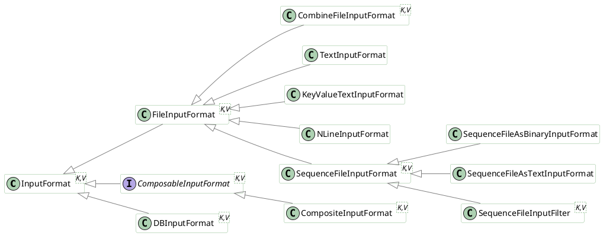
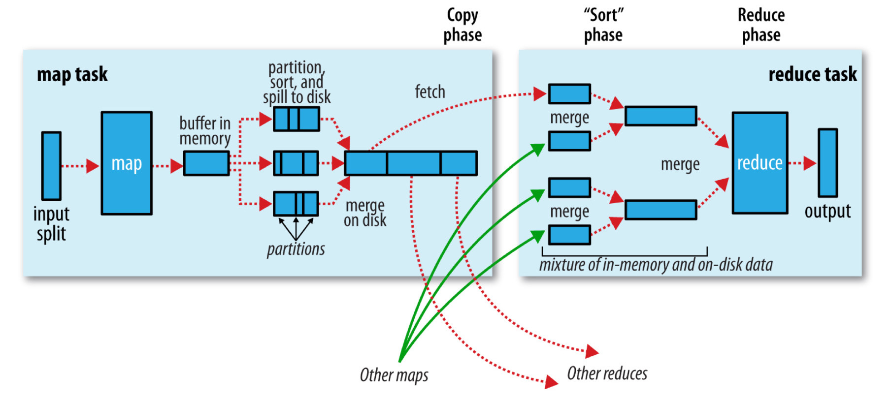

# MapReduce #

MapReduce是一个可靠的、容错的分布式数据处理框架。将业务处理逻辑抽象到map和reduce方法中，和作业的控制逻辑分离。

一个MapReduce作业通常将输入数据集划分成独立的块，并由map任务并行的处理。框架对map的结果排序后传入reduce任务。作业的输入和输出一般都存储在文件系统中。框架负责调度、监控任务，并重新执行失败的任务。

数据模型：`(input)<k1, v1> -> map -> <k2, v2> -> combine -> <k2, v2> -> reduce -> <k3, v3>(output)`

## 原理 ##

### input format ###

InputFormat层次结构：



输入分片（Input Split）是指单个map任务处理的输入数据块，每个map任务处理一个分片，每个分片被分成多条记录（record，一个键值对），map任务按顺序处理每条记录。分片和记录是逻辑概念，和文件无关。输入分片由Java类`InputSplit`表示。InputSplit不包含输入数据，仅包含数据大小（按字节计算）和一组存储位置（主机名称），是指向数据的引用。MapReduce使用存储位置实现data locality。数据大小用于对分片排序，较大的先处理，以减少作业运行时间。InputFormat用于创建输入分片并将它们划分成记录。

```java
public abstract class InputSplit {
    public abstract long getLength() throws IOException, InterruptedException;
    public abstract String[] getLocation() throws IOException, InterruptedException;
}
public abstract class InputFormat<K, V> {
    public abstract List<InputSplit> getSplits(JobContext context) throws IOException, InterruptedException;

    public abstract RecordReader<K, V> createRecordReader(InputSplit split, TaskAttemptContext context) thorws IOException, InterruptedException;
}
```

运行作业的客户端通过调用`getSplits()`计算作业的输入分片，然后把它们发送到Application Master，Application Master使用这些分片的存储位置调度map任务。map任务将分片传入InputFormat的`createRecordReader()`方法来获取这个分片的RecordReader，RecordReader就是记录的迭代器，map任务获取到一行记录后生成记录的键值对，然后传入map函数。

```java
// Mapper's run()
public void run(Context context) throws IOException, InterruptedException {
    setup(context);
    while (context.nextKeyValue()) {
        map(context.getCurrentKey(), context.getCurrentValue(), context);
    }
    cleanup(context);
}
```

CombineFileInputFormat用于将多个文件打包到一个分片中以便map处理，适用于小文件较多的场景。

禁止对文件分区的方法：

+ 设置`mapreduce.input.fileinputformat.split.minsize`大于输入文件大小最大值或者直接设置为`Long.MAX_VALUE`
+ 继承FileInputFormat的具体子类并重载`isSplitable()`方法返回false

### map ###

map将输入键值对映射到中间键值对，中间键值对的类型不必和输入键值对的相同，一个输入键值对可以生零个活多个键值对。

### reduce ###

MapReduce框架保证reducer的输入按键排序。

reduce分为三个阶段：shuffle、sort和reduce。

#### shuffle 和 sort ####

shuffle是框架执行排序并把map输出传入reducer的过程，是MapReduce的核心。



**map侧**：map并不是直接将输出写入磁盘，而是写入循环内存缓冲区（circular memory buffer），缓冲区默认100MB大小，可以通过`mapreduce.task.io.sort.mb`调整。当缓冲区的数据达到某个阈值（`mapreduce.map.sort.spill.percent`，默认为0.80）时，一个后台线程将开始将缓冲区中的数据写入磁盘（称为spill）。spill进行时map继续将输出写入缓冲区，但是当缓冲区写满时，map将阻塞直到spill完成。spill以轮询的方式将数据写入`mapreduce.cluster.local.dir`指定目录下的作业特定的子目录中。数据写入磁盘前，线程先根据数据将要发送到的reducer将它们分区。后台线程对每个分区中的数据按照键进行内存内排序，如果存在combiner函数，那么它将在排序的输出上运行。使用combiner函数将使map输出更紧凑，减少写入本地磁盘及发送给reducer的数据量。每次循环内存达到spill阈值时，都会创建一个新的spill文件，所以在map任务写出最后一条记录后，将会有多个spill文件。任务结束前，这些spill文件将会合并进一个单独的分区有序输出文件。`mapreduce.task.io.sort.factor`控制同时合并流的最大数目，默认是10。如果至少有三个spill文件（由`mapreduce.map.combine.minspills`设置），写入输出文件前将再次运行combiner。combiner需要满足运行多次且不影响最终结果。如果只有一个或两个spill文件，combiner减少map输出数据大小的效果比不上调用combiner的开销，所以不会再次运行combiner。最好在map输出写入磁盘前进行压缩，这样做将缩短写入磁盘的时间，节省磁盘空间，并减少发送到reducer的数据大小。默认输出不压缩，设置`mapreduce.map.output.compress`为true将启用压缩，使用的压缩库由`mapreduce.map.output.compress.codec`指定。输出文件的分区通过HTTP发送到reducer，`mapreduce.shuffle.max.threads`指定每台node manager发送分区的工作线程的最大数目。默认为0，表示线程最大数目为机器处理器数目的两倍。

**reducer侧**：map的输出文件位于运行map任务的机器的本地磁盘（map输出总是写入本地磁盘，而reduce输出可能不是），运行reduce任务的机器需要获取其将要处理的分区，分区中的数据来自集群上的多个map任务。map任务可能不同时结束，每个map任务结束后，reduce任务就开始复制它的输出。成为reduce任务的复制阶段。reduce任务有少量的复制线程来并行获取map输出。默认为五个线程，可以通过`mapreduce.reduce.parallelcopies`设置。map任务成功后，使用心跳机制通知application master。所以，对于给定任务，application master知道map输出和host之间的映射关系。reducer的一个线程周期性的向application master询问map输出host直到接收完所有数据。第一个reducer获取数据后host并不立即从磁盘删除map输出，因为reducer可能失败。相反，它们直到作业结束后被application master告知删除map输出时，才进行删除。map输出很小时将会被复制到reduce任务的JVM内存中（由`mapreduce.reduce.shuffle.input.buffer.percent`指定）；否则，它们将被复制到磁盘。当内存缓冲区到达阈值（`mapreduce.reduce.shuffle.merge.percent`）时，或map输出数目到达阈值时（`mapreduce.reduce.shuffle.merge.inmem.threshold`），内存缓存区中的数据将被合并并写入磁盘。指定combiner时，它将会在合并时执行来减少写入到磁盘的数据量。当磁盘上复制的数据增加时，一个后台线程将把它们合并成一个更大的有序文件，这将减少后面合并的时间。注意任何被压缩的map输出都要在内存中解压缩进而进行合并。当复制完所有map输出后，reduce任务进入到sort阶段（称为merger阶段更合适，因为sort发生在map侧），合并map输出，维持排序顺序。这将进行好几轮。比如，如果有50个map输出，并且合并因子是10（默认值，由`mapreduce.task.io.sort.factor`指定），将会进行五轮，每轮合并10个文件，最后生成5个中间文件。不再进行一轮来将5个文件合并成一个单独的排序文件，而是在最后一个阶段--reduce阶段--直接将数据传入reduce函数来减少一次写入磁盘的操作。最后的合并为内存内和磁盘上数据片段的混合。reduce阶段，对有序输出中的每个键调用一次reduce函数，这个阶段的输出直接写入输出文件系统，一般是HDFS。对于HDFS，由于node manager也是datanode，第一个块副本将被写入本地磁盘。

## 其他 ##

### counter ###

Counter是收集作业统计信息的有效方式。Hadoop为作业内置了一些Counter，报告作业的各种指标，主要分为task counter和job counter。task counter包括MapReduce counter、Filesystem counter、FileInputFormat counter、FileOutputFormat counter。

task counter收集任务执行期间的信息，同一个作业所有任务的结果被汇总。task counter由每个task attempt维护，并定期发送到Application master以便汇总。

## sort ##

对数据排序是MapReduce的核心，MapReduce中有以下几种排序：

+ 部分排序（partial sort）：MapReduce默认按照键对输入记录进行排序，每个reducer输出都是有序的，reducer间无序。适用于根据键查找的场景
+ 全排序（total sort）：使用单个分区或使用保持reducer间输出有序的partitioner
+ 二次排序（secondary sort）：用于对值排序

使用保持reducer间输出有序的partitioner实现全排序要求partitioner对数据分区均匀，不引起数据倾斜。通过对键空间抽样来分析键分布情况，进而得到一个较均匀的分区集合，可以联合使用`InputSampler`和`TotalOrderPartitioner`来实现。

```Java
public class SortByTemperatureUsingTotalOrderPartitioner extends Configured implements Tool {
  @Override
  public int run(String[] args) throws Exception {
    Job job = JobBuilder.parseInputAndOutput(this, getConf(), args);
    if (job == null) return -1;
    job.setInputFormatClass(SequenceFileInputFormat.class);
    job.setOutputKeyClass(IntWritable.class);
    job.setOutputFormatClass(SequenceFileOutputFormat.class);
    SequenceFileOutputFormat.setCompressOutput(job, true);
    SequenceFileOutputFormat.setOutputCompressorClass(job, GzipCodec.class);
    SequenceFileOutputFormat.setOutputCompressionType(job, CompressionType.BLOCK);
    job.setPartitionerClass(TotalOrderPartitioner.class);
    InputSampler.Sampler<IntWritable, Text> sampler = new InputSampler.writePartitionFile(job, sampler);

    Configuration conf = job.getConfiguration();
    String partitionFile = TotalOrderPartitioner.getPartitionFile(conf);
    URI partitionUri = new URI(partitionFile);
    job.addCacheFile(partitionUri);

    return job.waitForCompleion(true)?0:1;
  }
  public static void main(String[] args) throws Exception {
    int exitCode = ToolRunner.run(new SortByTemperatureUsingTotalOrderPartitioner(), args);
    System.exit(exitCode);
  }
}
```

Hadoop提供了TotalOrderPartitioner工具类用于全排序。使用TotalOrderPartitioner需要提供一个分区文件，这个分区文件中包含了`ReduceTaskNum-1`个键，并且这些键按照从小到大排序。在读取分区文件之后，TotalOrderPartitioner会判断键是不是BinaryComparable（意为字节可比）类型的。对于非BinaryComparable类型的键，TotalOrderPartitioner使用二分查找（`Arrays.binarySearch()`）确定键的分区，每次查找的时间复杂度为`O(logR)`，R为`ReduceTaskNum-1`；对于BinaryComparable类型的键，即字符串，将按照字典序进行排序，MapReduce采用Trie树查找确定键的分区，每次查找的时间复杂度为`O(m)`，m为Trie树深度。

Hadoop提供了InputSampler工具类用于对数据采样，InputSampler内置三个采样器：SplitSampler、RandomSampler、IntervalSampler。SplitSampler对每个分片中的前n行记录进行采样，RandomSample按照一定频率对所有记录做随机取样，IntervalSampler按照固定的间隔从每个分片中取样。也可以实现Sampler接口来自定义取样器。取样的目的在于生成大小近似相等的分区。

```Java
public class InputSampler<K,V> implements Tool {
  // 采样器接口
  public interface sampler<K,V> {
    /**
     * 从输入数据中获得一个数据采样子集，然后通过这些采样数据在Map端由TotalOrderPartitioner对输入数据分区，以保证不同reducer处理数据的有序性，该方法具体采样逻辑由继承类实现
     */
     K[] getSample(InputFormat<K,V> inf, JobConf job) throws IOException;
  }
  /**
   * 分片数据采样器，从每个分片中对前n条记录进行采样，效率最高
   */
  public static class SplitSampler<K,V> implements Sampler<K,V> {
    // ...
  }
  /**
   * 随机数据采样器，按照一定频率对所有记录进行随机取样
   */
  public static class RandomSampler<K,V> implements Sampler<K,V> {
    // ...
  }
  /**
   * 对每个分片按照固定间隔进行采样
   */
  public static class IntervalSampler<K,V> implements Sampler<K,V> {
    // ...
  }
}
```

二次排序的原理是：在map阶段的最后会使用partitoner对输出分区，每个分区对应一个reducer，分区内使用sort comparator对键进行排序，如果没有设置sort comparator就使用键的compareTo方法；在reduce阶段，reducer接收到所有映射到这个reducer的map输出后，使用sort comparator对所有数据进行排序，然后使用grouping comparator聚合同一个键的值（使用grouping comparator比较两个键，如果相等，则它们属于同一组，将它们的值放入到值迭代器中），构造一个键对应的值迭代器。

二次排序的步骤:

1. 使用自然键和自然值组成的复合键
2. sort comparator对复合键进行排序
3. 复合键的partitioner和grouping comparator进行分区和聚合时应该仅考虑自然键

```Java
public class MaxTemperatureUsingSecondarySort extends Configured implements Tool {
  static class MaxTempreatureMapper extends Mapper<LongWritable, Text, IntPair, NullWritable> {
    private NcdcRecordParser parser = new NcdcRecordRecordParser();

    @Override
    protected void map(LongWritable key, Text value, Context context) throws IOException, InterruptedException {
      parser.parse(value);
      if (parser.isValidTemperature()) {
        context.write(new IntPair(parser.getYearInt(), parser.getAirTemperature()), NullWritable.get());
      }
    }
  }
  public static class FirstPartitioner extends Partitioner<IntPair, NullWritable> {
    @Override
    public int getPartition(IntPair key, NullWritable value, int numPartitions) {
      return math.abs(key.getFirst() * 127) % numPartitions
    }
  }
  public static class KeyComparator extends WritableComparator {
    protected KeyComparator() {
      super(IntPair.class, true);
    }
    @Override
    public int compare(WritableComparable w1, WritableComparable w2) {
      IntPair ip1 = (IntPair) w1;
      IntPair ip2 = (IntPair) w2;
      int cmp = IntPair.compare(ip1.getFirst(), ip2.getFirst());
      if (cmp != 0) {
        return cmp;
      }
      return -IntPair.compare(ip1.getSecond(), ip2.getSecond());
    }
  }
  public static class GroupComparator extends WritableComparator {
    protected GroupComparator() {
      super(IntPair.class, true);
    }
    @Override
    public int compare(WritableComparable w1, WritableComparable w2) {
      IntPair ip1 = (IntPair) w1;
      IntPair ip2 = (IntPair) w2;
      return IntPair.compare(ip1.getFirst(), ip2.getFirst());
    }
  }
  @Override
  public int run(String[] args) throw Exception {
    Job job = JobBuilder.parseInputAndOutput(this, getConf(), args);
    if (job == null) return -1;
    job.setMapperClass(MaxTemperatureMapper.class);
    job.setPartitionerClass(FirstPartitioner.class);
    job.setSortComparatorClass(KeyComparator.class);
    job.setGroupingComparatorClass(GroupComparator.class);
    job.setReducerClass(MaxTemperatureReducer.class);
    job.setOutputKeyClass(IntPair.class);
    job.setOutputValueClass(NullWritable.class);

    return job.waitForCompletion(true)?0:1
  }
  public static void main(String[] args) throws Exception {
    int exitCode = ToolRunner.run(new MaxTemperatureUsingSecondarySort(), args);
    System.exit(exitCode);
  }
}
```

键的排序顺序由RawComparator确定：

1. 如果设置了属性`mapreduce.job.output.key.comparator.class`，显式指定或对Job调用`setSortComparatorClass()`，那么使用该类的实例
2. 否则，如果键是`WritableComparable`及其子类，那么将使用该键类型注册的comparator
3. 没有注册的comparator时，使用`RawComparator`。`RawComparator`反序列化将要比较的字节流为对象，然后再使用`WritableComparable`的`compareTo()`方法。

## API ##

```plantUML
@startuml
skinparam shadowing false

skinparam class {
    BorderColor #8FBC8F
    BackgroundColor White
    ArrowColor Gray
}

class Mapper <KEYIN, VALUEIN, KEYOUT, VALUEOUT> {
    void setup(Mapper.Context context);
    void map(KEYIN key, VALUEIN value, Mapper.Context context);
    void cleanup(Mapper.Context context);
    void run(Mapper.Context context);
}

class Reducer <KEYIN, VALUEIN, KEYOUT, VALUEOUT> {
    void setup(Reducer.Context context);
    void reduce(KEYIN key, Iterable<VALUEIN> values, Reducer.Context context);
    void cleanup(Reducer.Context context);
    void run(Reducer.Context context);
}

hide field
@enduml
```

Mapper：

+ `setup()`：任务开始时调用一次
+ `map()`：对输入分片（input spilt）中的每个键值对调用一次，默认为恒等函数
+ `cleanup()`：任务结束时调用一次
+ `run()`：对map处理进行更深入的控制

MapReduce框架内置了一些具有特定功能的Mapper：

+ `ChainMapper`：用于在单个Map任务中使用多个Mapper类。这些Mapper类将以管道形式调用，即第一个的输出成为第二个的输入，直到最后一个Mapper，最后一个Mapper的输出作为整个任务的输出。和`ChainReducer`联用实现链式（`[MAP+ / REDUCE MAP*]`）的MapReduce作业，大大减少磁盘IO
  * `addMapper()`方法用于添加Mapper类
+ `FieldSelectionMapper`：执行字段选取
+ `InverseMapper`：交换键值
+ `MultithreadedMapper`：Mapper的多线程实现，当Map处理每条记录都很耗时时，可以考虑`MultithreadedMapper`，对于IO密集型任务可能会带来性能提升
+ `RegexMapper`：提取和正则表达式匹配的文本
+ `TokenCounterMapper`：使用StringTokenizer拆分值中的单词并输出`<word, one>`对
+ `ValueAggregatorMapper`：实现了通用聚集Mapper
+ `WrappedMapper`：用于自定义Context

Reducer:

+ `setup()`：任务开始时调用一次
+ `reduce()`：对每个键调用一次，默认为恒等函数
+ `cleanup()`：任务结束时调用一次
+ `run()`：控制reduce任务如何执行

MapReduce框架内置了一些具有特定功能的Reducer：

+ `ChainReducer`：用于在单个Reduce任务中Reducer后链式调用多个Mapper
+ `FieldSelectionReducer`：进行字段选取
+ `IntSumReducer`：进行整型归约
+ `LongSumReducer`：进行长整型归约
+ `ValueAggratorCombiner`：实现通用聚集Combiner
+ `ValueAggratorReducer`：实现通用聚集Reducer
+ `WrappedReducer`：用于自定义Context

```java
import java.io.IOException;
import java.util.StringTokenizer;

import org.apache.hadoop.conf.Configuration;
import org.apache.hadoop.fs.Path;
import org.apache.hadoop.io.IntWritable;
import org.apache.hadoop.io.Text;
import org.apache.hadoop.mapreduce.Job;
import org.apache.hadoop.mapreduce.Mapper;
import org.apache.hadoop.mapreduce.Reducer;
import org.apache.hadoop.mapreduce.lib.input.FileInputFormat;
import org.apache.hadoop.mapreduce.lib.output.FileOutputFormat;
public class WordCount {

  public static class TokenizerMapper
       extends Mapper<Object, Text, Text, IntWritable>{

    private final static IntWritable one = new IntWritable(1);
    private Text word = new Text();

    public void map(Object key, Text value, Context context
                    ) throws IOException, InterruptedException {
      StringTokenizer itr = new StringTokenizer(value.toString());
      while (itr.hasMoreTokens()) {
        word.set(itr.nextToken());
        context.write(word, one);
      }
    }
  }

  public static class IntSumReducer
       extends Reducer<Text,IntWritable,Text,IntWritable> {
    private IntWritable result = new IntWritable();

    public void reduce(Text key, Iterable<IntWritable> values,
                       Context context
                       ) throws IOException, InterruptedException {
      int sum = 0;
      for (IntWritable val : values) {
        sum += val.get();
      }
      result.set(sum);
      context.write(key, result);
    }
  }

  public static void main(String[] args) throws Exception {
    Configuration conf = new Configuration();
    Job job = Job.getInstance(conf, "word count");
    job.setJarByClass(WordCount.class);
    job.setMapperClass(TokenizerMapper.class);
    job.setCombinerClass(IntSumReducer.class);
    job.setReducerClass(IntSumReducer.class);
    job.setOutputKeyClass(Text.class);
    job.setOutputValueClass(IntWritable.class);
    FileInputFormat.addInputPath(job, new Path(args[0]));
    FileOutputFormat.setOutputPath(job, new Path(args[1]));
    System.exit(job.waitForCompletion(true) ? 0 : 1);
  }
}
```
