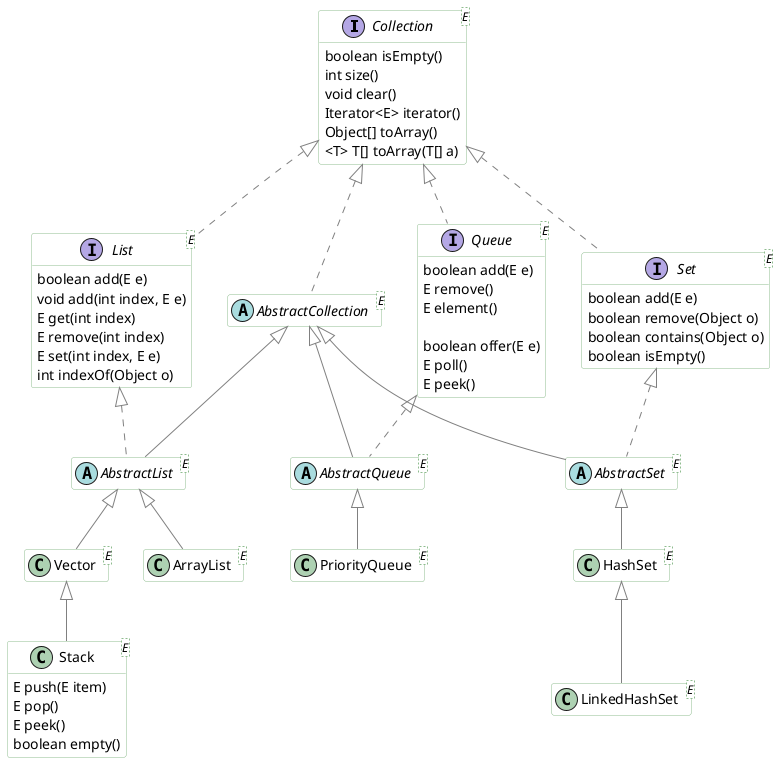
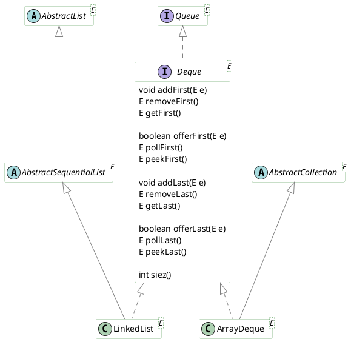
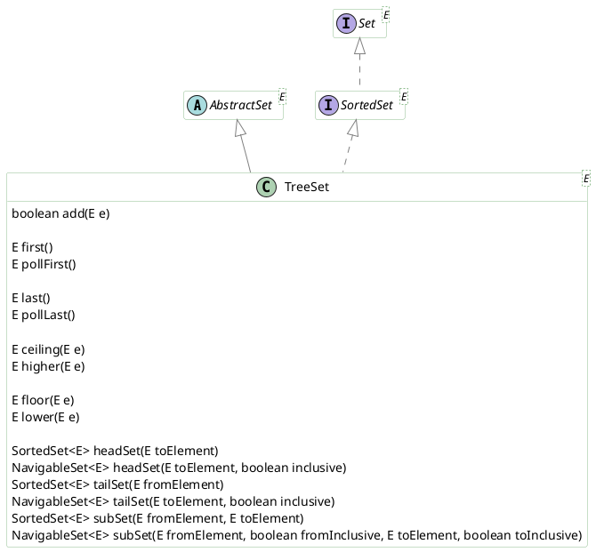
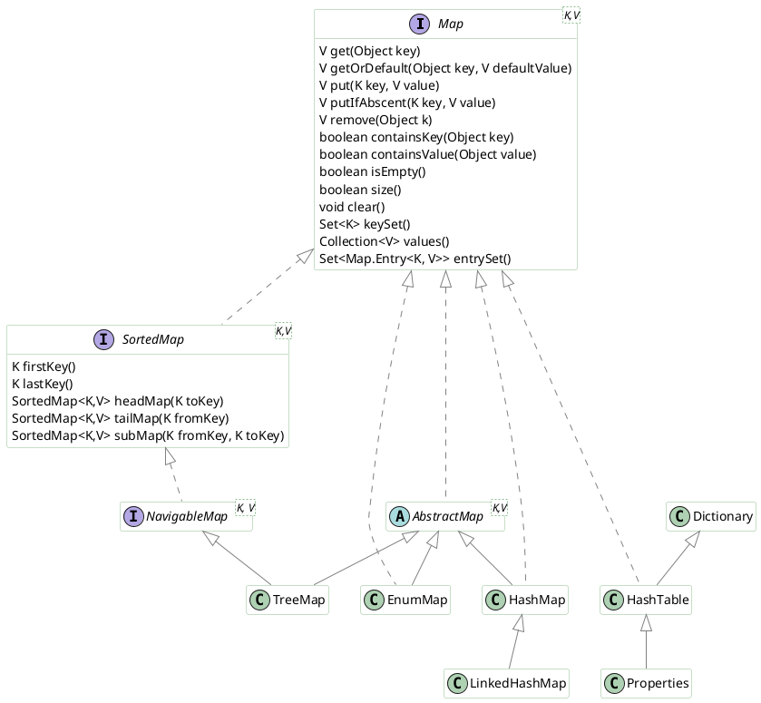
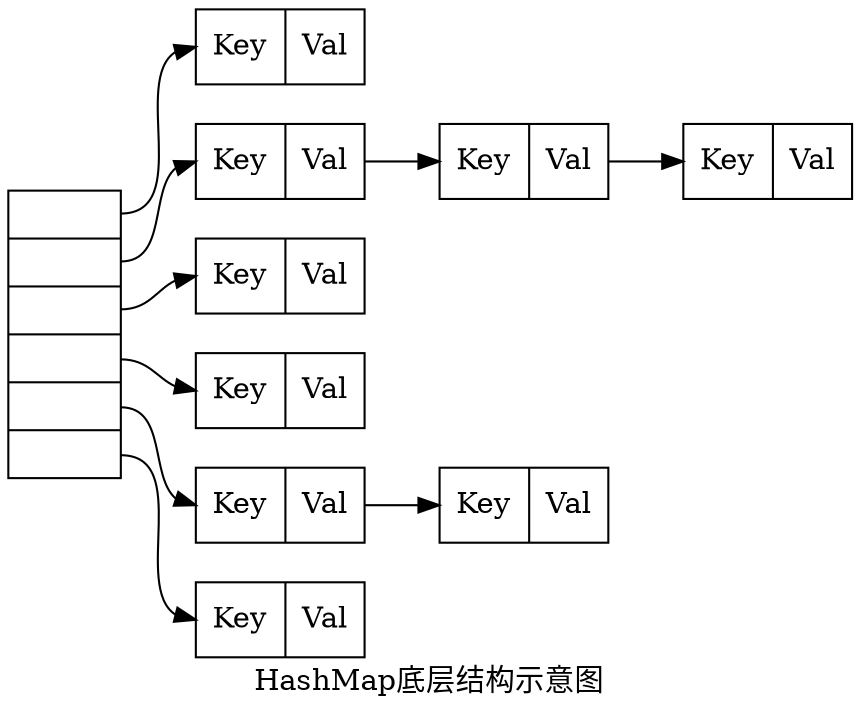

# Java集合框架 #

## 迭代器模式 ##

```plantUML
@startuml
skinparam shadowing false

skinparam stereoTypeI {
    BackgroundColor #FBF2CF
    BorderColor #D2BE74
}
skinparam class {
    BorderColor #8FBC8F
    BackgroundColor White
    ArrowColor Gray
}

interface Iterator<E> {
    void forEachRemaining(Consumer<? super E> action)
    boolean hasNext();
    E next();
    void remove();
}
interface ListIterator<E> {
    void add(E e);
    boolean hasNext();
    boolean hasPrevious();
    E next();
    int nextIndex();
    E previous();
    int previousIndex();
    void remove();
    void set(E e);
}
interface Iterable<T> {
    void forEach(Consumer<? super T> action);
    Iterator<T> iterator();
    Spliterator<T> spliterator();
}

hide field
@enduml
```

迭代器模式就是提供一种方法对一个容器对象中的各个元素进行访问，而又不暴露该对象容器的内部细节，即把访问逻辑从容器的具体实现中抽取出来，避免向外部暴露容器的内部结构。

Java中迭代器实现主要有：`Enumeration`、`Iterator`、`ListIterator`。

`Enumeration`是用于获取早期集合（Vector、HashTable）元素的接口，不适用于其他集合对象，无法执行删除操作，并且只能进行正向迭代。

`Iterator`是通用迭代器，适用于任何集合对象，支持读取和删除操作。

+ `remove()`从容器中移除该迭代器返回的上一个元素。

`ListIterator`近适用于实现List接口的类，是`Iterator`的增强版，支持双向迭代。

+ `add()`：向列表添加元素
+ `remove()`：删除`next()`或`previous()`返回的上个元素
+ `set()`：更新`next()`或`previous()`返回的上个元素

`Enumeration`、`Iterator`、`ListIterator`都是接口，需要在容器类中定义实现这些接口的内部类并在类中实现`iterator()`、`listIterator()`等方法返回这些内部类的实例，从而为容器赋予遍历功能。

实现了`Iterable`接口的容器可以在`forEach`中使用。`iterator()`返回该类的迭代器实例。

fail-fast（快速失效）是系统设计中一种立即报告任何可能表明故障的情况的系统，通常用于停止正常操作，而不是试图继续可能存在缺陷的过程。一般会在操作中的多个点检查系统的状态，因此可以及早检测到任何故障。快速失败系统的职责是检测错误，然后让系统的更高级别处理错误。

Java的fail-fast机制默认是指Java集合的一种错误检测机制，当多个线程对部分集合进行结构上的改变的操作时，有可能会触发fail-fast机制，抛出`CME`异常。另外，使用Iterator迭代一些容器时，该容器如果发生修改就会抛出`CME`异常，此时可以使用Iterator的`remove()`方法从容器中安全的删除元素。

## Collection ##



Collection接口是所有集合类的根。
Collections工具类提供了对集合进行的操作。
Java集合类包含三大类型：List、Set、Queue/Deque。

+ List是有序集合，支持按索引访问元素。
+ Set是一种不包含重复元素的集合。
+ Queue/Deque是Java提供的标准队列结构的实现，支持先入先出（FIFO）或者后入先出（LIFO）等特定行为。

Vector是Java早期提供的线程安全的动态数组，内部使用对象数组来保存数据，可以根据需要自动增加容量，当数组已满时，会创建新的数组，并复制原有数组数据。由于同步导致的额外开销不建议在不需要线程安全时使用Vector。

ArrayList是应用更加广泛的动态数组实现，与Vector相比，ArrayList不是线程安全的，性能好很多。另外，扩容时Vector会提高1倍，而ArrayList则是增加50%。

LinkedList是Java提供的双向链表，不是线程安全的。

PriorityQueue是Java提供的优先队列，基于二叉堆实现。内部使用数组存储数据，将数组作为一棵完全二叉树。

```Java
static final Object PRESENT = new Object();
```

TreeSet支持自然顺序访问，但是添加、删除、包含等操作相对低效。

HashSet利用哈希算法，理想情况下，可以提供常数时间的添加、删除、包含等操作，但是不保证有序。

与HashSet相比，LinkedHashSet通过内部记录插入顺序的双向链表提供按照插入顺序遍历的能力。但是由于需要维护链表，其添加、删除、包含等操作的性能略低于HashSet。

`TreeSet`、`HashSet`、`LinkedHashSet`底层都是通过相应的Map实现的，集合中的元素由内部Map的Key保存，Map的值为一个静态的Object对象。

```Java
static final Object PRESENT = new Object();
```

`HashSet`以`public`修饰的构造函数都是以`HashMap`作为实现，而以`LinkedHashMap`作为实现的构造函数使用默认访问权限，仅供`LinkedHashMap`的构造函数调用。

### Deque ###



LinkedList基于双向链表实现。

### SortedSet ###



## Map ##



Map是以键值对形式存储和操作数据的容器类型，其中不能包含相同的键，一个键至多对应一个值。

HashTable是早期Java类库提供的一个哈希表实现，是线程安全的，不支持null键和值，由于同步导致的性能开销，不推荐使用。

HashMap是应用更加广泛的哈希表表现，和HashTable相比，主要在于HashMap不是同步的，支持null键和值。通常情况下，HashMap进行put或者get操作可以达到常数时间的性能，是绝大部分利用键值对存取场景的首选。HashMap的性能表现非常依赖于哈希码的有效性，注意hashCode和equals的一些基本约定：

+ equals相等，hashCode一定要相等
+ 重写了hashCode也要重写equals
+ hashCode需要保持一致性，状态改变返回的哈希值仍然要一致
+ equals的对称、反射、传递等特性

和HashMap相比，LinkedHashMap通过维护一个双向链表支持按照插入顺序或访问顺序进行迭代，put、get、compute等都属于访问。

TreeMap基于红黑树实现，支持顺序访问，get、put、remove之类操作都是O(log(n))的时间复杂度，具体顺序可以由指定的Comparator来决定，或者根据键的自然顺序来判断。和LinkedHashMap相比，TreeMap迭代顺序由键的顺序关系（自然顺序，由Comparator或Comparable决定）决定，注意compareTo的返回值也需要和equals一致。

EnumMap中键必须来自单个枚举类型，该枚举类型在创建映射时显式或隐式地指定，键不能为null。

### HashMap ###

HashMap底层结构为数组（Node<K,V> table）和链表组成的复合结构（链表散列），数组被分为一个个桶（bucket），通过哈希值决定了键值对在这个数组的寻址；哈希值相同的键值对，以链表形式存储，如果链表大小超过阈值（TREEIFY_THRESHOLD，8），链表将被改造为树形结构。



链表结点的数据结构：

```Java
static class Node<K,V> implements Map.Entry<K,V> {
    final int hash;
    final K key;
    V value;
    Node<K,V> next;

    // ...
}
```

链表数组的定义：

```Java
// table在第一次使用时进行初始化，有需要时进行扩容（resize），大小总是2的幂数
transient Node<K,V>[] table;
```

进行put操作时，先根据key的hash值得到这个元素在数组中的位置，如果该位置上已经存放有其他元素了，那么在该位置上的元素将以链表的形式存放，新加入的放在链头，最先加入的在链尾。
执行get操作时，首先计算key的hash值，找到数组中的对应位置，然后通过key的equals方法在对应位置的链表中找到需要的元素。

HashMap的put方法分析：

```Java
public V put(K key, V value) {
    return putVal(hash(key), key, value, false, true);
}
final V putVal(int hash, K key, V value, boolean onlyIfAbent, boolean evit) {
    Node<K,V> tab;
    Node<K,V> p;
    int i, n;
    if ((tab = table) == null || (n = tab.length) == 0)  // 如果表为null，resize负责初始化
        n = (tab = resize()).length;
    if ((p = tab[i = (n-1) & hash]) == null)
        tab[i] = new Node(hash, key, value, null);
    else {
        // ...
        if (binCount >= TREEIFY_THRESHOLD - 1) // -1 for first
            treeifyBin(tab, hash);
        // ...
    }
}
```

+ `resize()`方法兼顾两个职责，创建初始存储表格，或者在容量不满足需求的时候进行扩容
+ 在放置新的键值对的过程中，如果发生了下面条件，就会发生扩容

    ```Java
    if (++size > threshold)
        resize();
    ```

+ 具体键值对在哈希表中的位置（数组索引）取决于下面的位运算：

    ```Java
    i = (n-1) & hash
    ```

  原因在于有些数据计算出的哈希值差异主要在高位，而HashMap里的哈希寻址是忽略容量以上的高位的，这样处理可以有效避免类似情况下的哈希碰撞。

    ```Java
    static final int hash(Object key) {
        int h;
        return (key == null) ? 0 : (h = key.hashCode()) ^ (h >>> 16);
    }
    ```

+ 链表会在达到一定阈值时发生树化

初始化、扩容以及树化都和`putVal`方法有关。

HashMap的`resize`方法：

```Java
final Node<K,V>[] resize() {
    Node<K,V>[] oldTab = table;
    int oldCap = (oldTab == null) ? 0 : oldTab.length;
    int oldThr = threshold;
    int newCap, newThr = 0;
    if (oldCap > 0) {
        if (oldCap >= MAXIMUM_CAPACITY) {
            threshold = Integer.MAX_VALUE;
            return oldTab;
        }
        else if ((newCap = oldCap << 1) < MAXIMUM_CAPACITY &&
                    oldCap >= DEFAULT_INITIAL_CAPACITY)
            newThr = oldThr << 1; // double threshold
    }
    else if (oldThr > 0) // initial capacity was placed in threshold
        newCap = oldThr;
    else {               // zero initial threshold signifies using defaults
        newCap = DEFAULT_INITIAL_CAPACITY;
        newThr = (int)(DEFAULT_LOAD_FACTOR * DEFAULT_INITIAL_CAPACITY);
    }
    if (newThr == 0) {
        float ft = (float)newCap * loadFactor;
        newThr = (newCap < MAXIMUM_CAPACITY && ft < (float)MAXIMUM_CAPACITY ?
                    (int)ft : Integer.MAX_VALUE);
    }
    threshold = newThr;
    @SuppressWarnings({"rawtypes","unchecked"})
        Node<K,V>[] newTab = (Node<K,V>[])new Node[newCap];
    table = newTab;
    // 移动元素 将数组中的链表拆分到新数组中的两个位置，或者拆分树
```

+ 阈值等于（负载因子）*（容量），如果构建HashMap时没有指定，就依据相应的默认常量值
+ 阈值通常是以倍数进行调整，当元素个数超过阈值大小时，则调整Map大小
+ 扩容后，需要将老数组中的元素重新放置到新的数组，这是扩容的一个主要开销来源

容量和负载系数决定了可用的桶的数量，空桶太多会浪费空间，如果使用太满则会严重影响操作的性能。如果能够知道HashMap要存取的键值对数量，可以考虑预先设置合适的容量大小。预先设置的容量要满足：大于预估元素数量/负载因子，同时是2的幂数。对于负载因子，建议使用JDK自身的默认值，调整的话不要超过0.75。

树化改造的逻辑主要在putVal和treeifyBin中：

```Java
final void treeifyBin(Node<K,V>[] tab, int hash) {
    int n, index;
    Node<K,V> e;
    if (tab == null || (n = tab.length) < MIN_TREEIFY_CAPACITY)
        resize();
    else if ((e = tab[index = (n - 1) & hash]) != null) {
        TreeNode<K,V> hd = null, tl = null;
        do {
            TreeNode<K,V> p = replacementTreeNode(e, null);
            if (tl == null)
                hd = p;
            else {
                p.prev = tl;
                tl.next = p;
            }
            tl = p;
        } while ((e = e.next) != null);
        if ((tab[index] = hd) != null)
            hd.treeify(tab);
    }
}
```

当bin（链表结构）的数量大于TREEIFY_THRESHOLD时：

+ 如果容量小于MIN_TREEIFY_CAPACITY，只会进行简单的扩容
+ 如果容量大于MIN_TREEIFY_CAPACITY，则会进行树化改造

进行树化改造主要是为了防止哈希碰撞拒绝服务攻击（哈希冲突发生频繁导致链表过长，性能退化）。

+ 多线程put操作可能导致get死循环
+ 多线程put非null元素后，get操作得到null值
+ 多线程put操作可能导致元素丢失

### LinkedHashMap ###

LinkedHashMap使用双向链表保证迭代顺序。

可以在创建时指定迭代顺序：

```java
public LinkedHashMap(
    int initialCapacity,
    float loadFactor,
    boolean accessOrder
)
```

accessOrder为true时按照访问顺序，为false时按照插入顺序。

LinkedHashMap的结点Entry<K,V>继承自HashMap.Node<K,V>，增加了向前和向后的引用，构成双向链表。

```Java
static class Entry<K,V> extends HashMap.Node<K,V> {
    Entry<K,V> before, after;
    // ...
}
```

类成员中增加了`head`、`tail`，分别指向双向链表的头结点和尾结点。

```Java
transient LinkedHashMap.Entry<K,V> head;
transient LinkedHashMap.Entry<K,V> tail;
```

添加元素时，LinkedHashMap只是重写了构建新结点的`newNode()`方法，将新结点放到双向链表末尾。

```Java
Node<K,V> newNode(int hash, K key, V value, Node<K,V> e) {
    LinkedHashMap.Entry<K,V> p =
        new LinkedHashMap.Entry<K,V>(hash, key, value, e);
    linkNodeLast(p);
    return p;
}
// 讲结点加入双向链表末尾
private void linkNodeLast(LinkedHashMap.Entry<K,V> p) {
    LinkedHashMap.Entry<K,V> last = tail;
    tail = p;
    if (last == null)
        head = p;
    else {
        p.before = last;
        last.after = p;
    }
}
```

`accessOrder`为`true`时，对LinkedHashMap执行访问操作（`get`、`getOrDefault`、`replace`、`compute`等）会触发`afterNodeAccess()`方法，该方法将被访问的结点移动到双向链表的尾部。

```Java
// 将结点移动到双向链表尾部
void afterNodeAccess(Node<K,V> e) {
    LinkedHashMap.Entry<K,V> last;
    if (accessOrder && (last = tail) != e) {
        LinkedHashMap.Entry<K,V> p =
            (LinkedHashMap.Entry<K,V>)e, b = p.before, a = p.after;
        p.after = null;
        if (b == null)
            head = a;
        else
            b.after = a;
        if (a != null)
            a.before = b;
        else
            last = b;
        if (last == null)
            head = p;
        else {
            p.before = last;
            last.after = p;
        }
        tail = p;
        ++modCount;
    }
}
```

迭代器LinkedHashIterator通过遍历双向链表保证遍历顺序与插入顺序或访问顺序一致。

```Java
final LinkedHashMap.Entry<K,V> nextNode() {
    LinkedHashMap.Entry<K,V> e = next;
    if (modCount != expectedModCount)
        throw new ConcurrentModificationException();
    if (e == null)
        throw new NoSuchElementException();
    current = e;
    next = e.after;
    return e;
}
```

LinkedHashMap会在添加新结点后调用`afterNodeInsertion()`，通过重写removeEldestEntry可以控制是否删除最早插入或最早访问的结点以及删除策略。

```Java
void afterNodeInsertion(boolean evict) { // possibly remove eldest
    LinkedHashMap.Entry<K,V> first;
    if (evict && (first = head) != null && removeEldestEntry(first)) {
        K key = first.key;
        removeNode(hash(key), key, null, false, true);
    }
}
```
