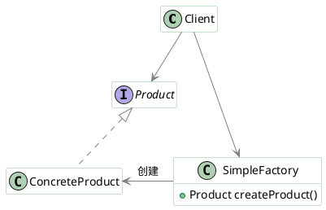
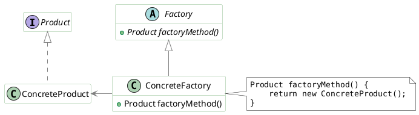
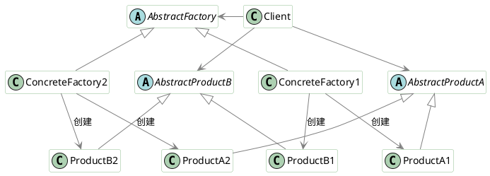
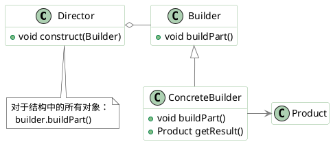

# 设计模式（Design Pattern） #

设计模式是人们为软件开发中相同表证的问题，抽象出的可重复利用的解决方案。在某种程度上，设计模式代表了一些特定情况的最佳实践。

按照模式的应用目标分类，设计模式可以分为创建型模式、结构型模式和行为型模式。

+ 创建型模式：是对对象创建过程的各种问题和解决方案的总结，包括各种工厂模式（Factory、Abstract Factory）、单例模式（Singleton）、构建器模式（Builder）、原型模式（ProtoType）
+ 结构型模式：是针对软件设计结构的总结，关注于类、对象继承、组合方式的实践经验，包括桥接模式（Bridge）、适配器模式（Adapter）、装饰者模式（Decorator）、代理模式（Proxy）、组合模式（Composite）、外观模式（Facade）、享元模式（Flyweight）
+ 行为型模式：是从类或对象之间交互、职责划分等角度总结的模式，包括策略模式（Strategy）、解释器模式（Interpreter）、命令模式（Command）、观察者模式（Observe）、迭代器模式（Iterator）、模板方法模式（TemplateMethod）、访问者模式（Visitor）

## 单例模式（Singleton） ##

目的：确保一个类只有一个实例，并提供该实例的全局访问点。

类图：



```plantuml
@startuml
skinparam shadowing false
skinparam class {
    BorderColor #8FBC8F
    BackgroundColor White
    ArrowColor Gray
}
skinparam stereoTypeC {
    BackgroundColor #DED5E6
    BorderColor #9B85AE
}
class Singleton {
    - {static} Singleton instance
    - Singleton()
    + {static} Singleton getInstance()
}
@enduml
```

实现：

1. 懒汉式：线程不安全

    ```Java
    public class Singleton {
        private static Singleton instance;

        private Singleton() {}

        public static Singleton getInstance() {
            if (instance == null) {
                instance = new Singleton();
            }
            return instance;
        }
    }
    ```

2. 饿汉式：线程安全

    ```Java
    public class Singleton {
        private static Singleton instance = new Singleton();
        private Singleton() {}
        public static Singleton getInstance() {
            return instance;
        }
    }
    ```

3. 懒汉式：线程安全

    ```Java
    public class Singleton {
        private static Singleton instance;
        private Singleton() {}
        public static synchronized Singleton getInstance() {
            if (instance == null) {
                instance = new Singleton();
            }
            return instance;
        }
    }
    ```

4. 双重校验锁：线程安全

    ```Java
    public class Singleton {
        private volatile static Singleton instance;
        private Singleton() {}
        public static Singleton getInstance() {
            if (instance == null) {
                synchronized (Singleton.class) {
                    if (instance == null) {
                        instance = new Singleton();
                    }
                }
            }
            return instance;
        }
    }
    ```

5. 静态内部类实现：当Singleton类被加载时，静态内部类SingletonHolder没有被加载进内存，只有当调用`getUniqueInstance()`方法从而触发`SingletonHolder.INSTANCE`时SingletonHolder才会被加载，此时初始化INSTANCE实例，并且JVM能确保INSTANCE只被实例化一次。

    ```Java
    public class Singleton {
        private Singleton() {}

        private static class SingletonHolder {
            private static final Singleton INSTANCE = new Singleton();
        }

        public static Singleton getInstance() {
            return SingletonHolder.INSTANCE;
        }
    }
    ```

6. 枚举实现

   ```Java
   public enum Singleton {
       INSTANCE;

       public Singleton getInstance() {
           return INSTANCE;
       }
   }
   ```

## 简单工厂（Simple Factory） ##

目的：在创建一个对象时不向客户暴露内部细节，并提供一个创建对象的通用接口。

简单工厂把实例化的操作单独放到一个类中，这个类就成为简单工厂类，让简单工厂类来决定应该用哪个具体子类来实例化，这样就能把客户类和具体子类的实现解耦。

类图：



## 工厂方法（Factory Method） ##

目的：定义了一个创建对象的接口，但由子类决定要实例化哪个类，工厂方法把实例化操作推迟到子类。

在简单工厂中，创建对象的是另一个类，而在工厂方法中，是由子类来创建对象。

类图：



## 抽象工厂（Abstract Factory） ##

目的：提供一个接口，用于创建相关的对象家族。

抽象工厂模式创建的是对象家族，即很多对象而不是一个对象，并且这些对象是相关的，必须一起创建出来。而工厂方法模式只是用于创建一个对象，和抽象工厂模式有很大不同。从高层次来看，抽象工厂使用了组合，而工厂方法模式使用了继承。

类图：



## 生成器（Builder） ##

目的：封装一个对象的构造过程，并允许按步骤构造。

类图：



## 原型模式（Prototype） ##

## 责任链（Chain Of Responsibility） ##

## 命令模式（Command） ##

## 解释器模式（Interpreter） ##

## 迭代器模式（Iterator） ##

## 观察者模式（Observer） ##

## 策略模式（Strategy） ##

## 模板方法（Template Method） ##

## 访问者模式（Visitor） ##

## 适配器模式（Adapter） ##

## 桥接模式（Bridge） ##

## 组合模式（Composite） ##

## 装饰器模式（Decorator） ##
