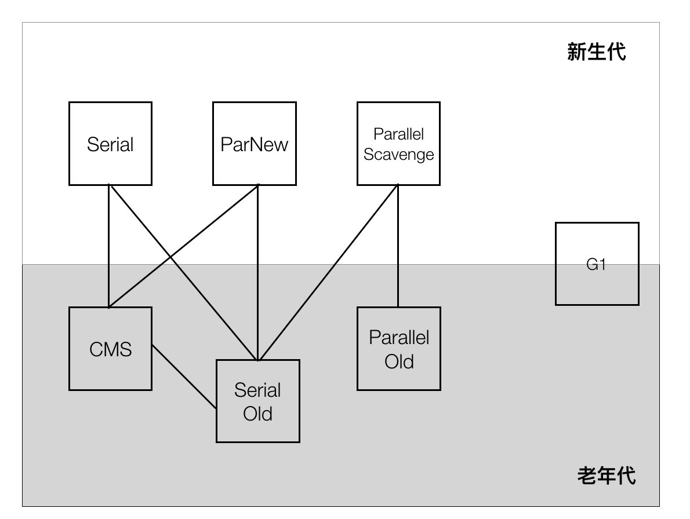
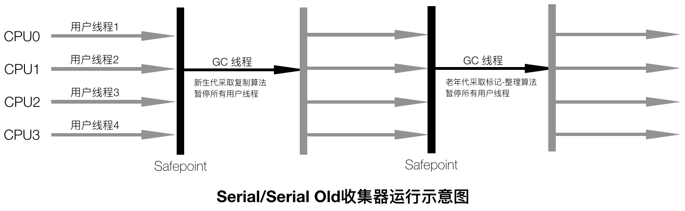
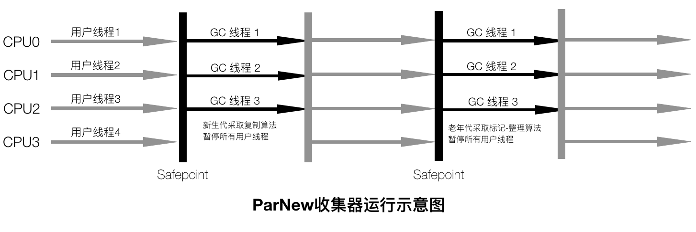

# Java 内存区域与垃圾收集 #

Java与C++之间有一堵由内存动态分配和垃圾收集技术所围成的高墙，墙外面的人想进去，墙里面的人却想出来。

Java的自动内存管理（内存动态分配和垃圾收集技术）最终归结为自动化地解决了两个问题：给对象分配内存以及回收分配给对象的内存。

## Java运行时数据区域 ##

Java虚拟机在执行Java程序的过程中会把它所管理的内存划分为若干个不同的数据区域：方法区（method area）、堆（heap）、程序计数器（program counter register）、虚拟机栈（vm stack）、本地方法栈（native method stack）。其中，方法区和堆为所有线程共享，生命周期与虚拟机进程相同，程序计数器、虚拟机栈和本地方法栈是线程私有的，生命周期与线程相同。

**程序计数器**是一块较小的内存空间，如果线程正在执行的是一个Java方法，这个计数器记录的是正在执行的虚拟机字节码指令的地址；如果正在执行的是Native方法，这个计数器值则为空（Undefined），此内存区域是唯一一个在Java虚拟机规范中没有规定任何OutOfMemoryError情况的区域。

**虚拟机栈**描述的是Java方法执行的内存模型：每个方法在执行的同时会创建一个栈帧（Stack Frame）用于存储局部变量表、操作数栈、动态链接、方法出口等信息，每一个方法从调用直至执行完成的过程，就对应一个栈帧在虚拟机中入栈到出栈的过程。局部变量表存放了编译期可知的各种基本数据类型（boolean、byte、char、short、int、float、long、double）、对象引用（reference类型，可能是一个指向对象起始地址的引用指针，也可能是指向一个代表对象的句柄或其他与此对象相关的位置）和returnAddress类型（指向了一条字节码指令的地址）。这个区域可能发生两种异常状况：如果线程请求的栈深度大于虚拟机所允许的深度，将抛出StackOverflowError异常；如果虚拟机栈可以动态扩展，且扩展时无法申请到足够的内存，就会抛出OutOfMemoryError异常。

**本地方法栈**与虚拟机栈作用相似，只不过虚拟机栈为虚拟机执行Java方法服务，而本地方法栈则为虚拟机使用到的Native方法服务。本地方法栈区域也会抛出StackOverflowError和OutOfMemoryError异常。

**Java堆**是Java虚拟机所管理的最大的一块内存区域，被所有线程共享，在虚拟机启动时创建，唯一目的就是存放对象实例，即所有的对象实例以及数组都要在堆上分配。Java堆是垃圾收集器管理的主要区域，从内存回收角度看，对于分代收集算法，Java堆还可以细分为新生代和老年代，其中，新生代又可以细分为Eden空间、From Survivor空间、To Survivor空间。从内存分配角度看，线程共享的Java堆可能划分出多个线程私有的分配缓冲区（Thread Local Allocation Buffer，TLAB）。Jva堆可以处于物理上不连续的内存空间中，只要逻辑上是连续的即可。这个内存区域可能抛出OutOfMemoryError异常，如果在堆中没有内存完成实例分配，并且堆也无法再扩展时，将会抛出OutOfMemoryError异常。

**方法区**用于存储已被虚拟机加载的类信息、常量、静态变量、即使编译器编译后的代码等数据，对于HotSpot虚拟机，方法区也成为永久代（Permanent Generation），在JDK 1.7的HotSpot中，把原本放在永久代的字符串常量池移出。Java虚拟机规范堆方法区的限制非常宽松，不需要连续的内存和可以选择固定大小或者可扩展，还可以选择不实现垃圾收集。这个区域的内存回收目标主要是针对常量池的回收和对类型的卸载。这个区域可能抛出OutOfMemoryError异常，当方法区无法满足内存分配需求时，将抛出OutOfMemoryError异常。

运行时常量池（runtime constant pool）是方法区的一部分，一般用于存储Class文件中描述的符号引用和翻译出来的直接引用，另外，运行时常量池具备动态性，运行期间也可以将新的常量放入池中，比如String类的`intern()`方法。当常量池无法再申请到内存时会抛出OutOfMemoryError异常。

直接内存（direct memory）并不是虚拟机运行时数据区的一部分，也不是Java虚拟机规范中定义的内存区域。JDK 1.4新加入了NIO类，引入了一种基于通道（channel）与缓冲区（Buffer）的I/O方式，可以使用Native函数库直接分配对外内存，然后通过一个存储在Java堆中的DirectByteBuffer对象作为这块内存的引用进行操作，这样能哎一些场景中显著提高性能，因为避免了在Java堆和Native堆中来回复制数据。本机直接内存的分配不会受到Java堆大小的限制，但是受到本机总内存大小以及处理器寻址空间的限制，当动态扩展且无法申请到足够的内存时，就会抛出OutOfMemeoryError。

## 垃圾收集 ##

垃圾收集（Garbge Collection，GC）的主要目标区域是Java堆和方法区。

判断对象是否存活有两种算法：

+ 引用计数算法（Reference Counting）：给对象中添加一个引用计数器，每当有一个地方引用它时，计数器值就加1；当引用失效时，计数器值就减1；任何时刻计数器为0的对象就是不可能在被使用的。引用计数算法实现简单，判定效率也很高，但是很难解决对象之间相互循环引用的问题
+ 可达性分析算法（Reachability Analysis）：通过一系列GC Roots对象作为起始点，从这些节点开始向下搜索，搜索所走过的路径称为引用链（Reference Chain），当一个对象到GC Roots没有任何引用链相连（即从GC Roots到这个对象不可达）时，则证明此对象是不可用的。在Java语言中，可作为GC Roots的对象包括下面几种：
  * 虚拟机栈（栈帧中的本地变量表）中引用的对象
  * 方法区中类静态属性引用的对象
  * 方法区中常量引用的对象
  * 本地方法栈中JNI（即Native方法）引用的对象

在JDK 1.2之前，Java中的引用定义为：如果reference类型的数据中存储的数值代表的是另外一块内存的起始地址，就称这块内存代表着一个引用。

在JDK 1.2之后，Java将引用分为强引用、软引用、弱引用和虚引用，这4种引用强度依次减弱：

+ 强引用（Strong Reference）：指在程序代码之中普遍存在的，类似`Object obj = new Object()`这类的引用，只要强引用还存在，垃圾收集器永远不会回收掉被引用的对象
+ 软引用（Soft Reference）：用来描述一些还有用但并非必须的对象，对于软引用关联着的对象，在系统将要发生内存溢出异常之前，将会把这些对象列进回收范围之内进行第二次回收，如果这次回收还没有足够的内存，才会抛出内存溢出异常，JDk 1.2之后提供了SoftReference类来实现软引用
+ 弱引用（Weak Reference）：用来描述非必需对象，强度比软引用更弱一些，被弱引用关联的对象只能生存到下一次垃圾收集发生之前。当垃圾收集器工作时，无论当前内存是否足够，都会回收掉只被弱引用关联的对象，JDK 1.2之后提供了WeakReference类来实现弱引用
+ 虚引用（Phantom Reference）：也称为幽灵引用或者幻影引用，是最弱的一种引用关系，一个对象是否有虚引用的存在，完全不会对其生存时间构成影响，也无法通过虚引用来取得一个对象实例。为一个对象设置虚引用关联的唯一目的就是能在这个对象被收集器回收时收到一个系统通知，JDK 1.2之后提供了Phantom Reference类来实现虚引用

要真正宣告一个对象死亡，至少要经历两次标记过程：如果对象在进行可达性分析后发现没有与GC Roots相连接的引用链，那它将会被第一次标记并且进行一次筛选，筛选的条件是此对象是否有必要执行finalize()方法。当对象没有覆盖finalize()方法，或者finalize()方法已经被虚拟机调用过，虚拟机将这两种情况都视为没有必要执行。如果这个对象被判定为有必要执行finalize()方法，那么这个对象将会放置在一个叫做F-Queue的队列中，并在稍后由一个虚拟机自动建立的、低优先级的Finalizer线程去执行它。执行是指虚拟机会触发这个方法，但是不承诺会等待它运行结束。finalize()方法是对象逃脱死亡命运的最后一个机会，稍后GC将对F-Queue中的对象进行第二次小规模的标记，如果对象要在finalize()中成功拯救自己（只要重新和引用链上的任何一个对象建立关联即可），那在第二次标记时它将被移除出即将回收的集合。如果对象这时候还没有逃脱，基本上就真的被回收了。

注意，**任何一个对象的finalize()方法都只会被系统自动调用一次**，如果对象面临下一次回收，它的finalize()方法不会被再次执行。finalize()方法运行代价高昂，不确定性大，无法保证各个对象的调用顺序，而关闭外部资源之类的工作使用try-finally或者其他方式都可以做得更好、更及时，所以不建议使用finalize()方法。

Java虚拟机规范中不要求虚拟机在方法区实现垃圾收集。而且在方法区中进行垃圾收集的性价比一般比较低（远远低于新生代70%~95%的可回收空间）。永久代的垃圾收集主要回收两部分内容：废弃常量和无用的类。废弃常量是说没有任何对象引用这个常量，且其他地方也没有引用这个字面量。无用类则需要同时满足下面3个条件：

+ 该类所有的实例都已经被回收，也就是Java堆中不存在该类的任何实例
+ 加载该类的ClassLoader已经被回收
+ 该类对应的java.lang.Class对象没有在任何地方被引用，无法在任何地方通过反射访问该类的方法

HotSpot虚拟机提供了`-Xnoclassgc`参数控制对类是否进行回收。使用`-verbose:class`以及`-XX:+TraceClassLoading`、`-XX:+TraceClassUnLoading`可以查看类加载和卸载信息。

### 垃圾收集算法 ###

**标记-清除（Mark-Sweep）算法**是最基础的收集算法，算法分为标记和清除两个阶段：首先标记出所有需要回收的对象，在标记完成后统一回收所有被标记的对象。

主要不足有两个：一是效率问题，标记和清除两个过程的效率都不高；另一个是空间问题，标记清除之后会产生大量不连续的内存碎片，空间碎片太多可能会导致以后在程序运行过程中需要分配较大对象时，无法找到足够的连续内存而不得不提前触发另一次垃圾收集动作。

**复制（copying）收集算法**将可用内存按容量划分为大小相等的两块，每次只使用其中的一块。当这一块的内存用完了，就将还存活着的对象复制到另外一块上面，然后再把已使用过的内存空间一次清理掉。这样使得每次都是对整个半区进行内存回收，内存分配时也就不用考虑内存碎片等复杂情况，只要移动堆顶指针，按顺序分配内存即可。

主要不足有两个：一是将内存缩小为了原来的一半，代价太高；另一个是复制收集算法在对象存活率较高时就要进行较多的复制操作，效率将会变低。

**标记-整理（Mark-Compact）算法**标记过程仍然与标记-清除算法一样，但后续步骤不是直接对可回收对象进行清理，而是让所有存活的对象都向一端移动，然后直接清理掉端边界以外的内存。

**分代（Generational Collection）收集算法**根据对象存活周期的不同将内存划分为几块（一般是将Java堆分为新生代和老年代），然后根据各个年代的特点采用最适当的收集算法。

新生代中对象存活率低，采用复制收集算法。新生代中的对象98%是朝生夕死的，并不需要按照1:1的比例来划分内存空间，而是将内存分为一块较大的Eden空间和两块较小的Survivor空间，每次使用Eden和其中一块Survivor。当回收时，将Eden和Survivor中还存活着的对象一次性地复制到另外一块Survivor空间上，最后清理掉Eden和用过的Survivor空间。HotSpot虚拟机默认Eden和Survivor的大小比例是8:1，即每次新生代中可用内存空间为整个新生代容量的90%，只有10%的内存会被浪费。当Survivor空间不够用时，需要依赖其他内存（老年代）进行分配担保，即Survivor空间没有足够空间存放上一次新生代收集下来的存活对象时，这些对象将直接通过分配担保机制进入老年代。

老年代中对象存活率高、没有额外空间对它进行分配担保，必须采用标记-清理或者标记-整理算法来进行回收。

**枚举GC Roots**可作为GC Roots的节点主要在全局性的引用（例如常量或类静态属性）与执行上下文（例如栈帧中的本地变量表）中，数量较大，逐个检查耗时较多。另外，可达性分析必须在一个能确保一致性的快照中进行（一致性是指整个分析期间整个执行系统看起来像被冻结在某个时间点上，不可以出现分析过程中对象引用关系还在不断变化的情况），所以GC进行时必须停顿所有Java执行线程，称为Stop The World（STW）。

目前主流Java虚拟机使用的都是准确式GC，当执行系统停顿下来后，并不需要一个不漏地检查完所有执行上下文和全局的引用位置，虚拟机有办法直接得知哪些地方存放着对象引用。

在HotSpot的是实现中，是使用一组称为OopMap（Ordinary Object Pointer，普通对象指针）的数据结构来达到这个目的的，在类加载完成的时候，HotSpot就把对象内什么偏移量上是什么类型的数据计算出来，在JIT编译过程中，也会在特定的位置记录下栈和寄存器中哪些位置是引用，这样，GC在扫描时就可以直接得知这些信息。所以，在OopMap的协助下，HotSpot可以快速且准确地完成GC Roots枚举。

如果为每一条可能导致引用关系变化（或者OopMap内容变化）的指令都生成对应的OopMap，将会需要大量的额外空间，GC的空间成本就会很高。HotSpot只是在特定的位置记录了这些信息，这些位置称为安全点（Safepoint）即程序执行时并非在所有地方都能停顿下来开始GC，只有在到达安全点时才能暂停。

安全点机制保证了程序执行时，在不太长的时间内就会遇到可进入GC的安全点。安全点的选择以程序*是否具有让程序长时间执行的特征*为标准，*长时间执行*的最明显特征就是指令序列复用，如方法调用、循环跳转、异常跳转等，具有这些功能的指令才会产生安全点。

有两种方式实现GC发生时所有线程（不包括执行JNI调用的线程）都跑到最近的安全点上再停顿：抢先式中断（Preemptive Suspension）和主动式中断（Voluntary Suspension）。抢先式中断不需要线程的执行代码主动去配合，在GC发生时，首先把所有线程全部中断，如果发现有线程中断的地方不在安全点上，就恢复线程，让它跑到安全点。主动式中断是当GC需要中断线程的时候，不直接对线程操作，仅仅简单地设置一个标志，各个线程执行时主动去轮询这个标志，发现中断标志为真时就自己中断挂起。轮询标志的地点和安全点是重合的，另外再加上创建对象需要分配内存的地方。主流虚拟机实现都采用主动式中断。

安全区域（Safe Region）机制用于线程处于Sleep状态或者Blocked状态时无法响应JVM中断请求走到安全点再挂起的场景。安全区域是指在一段代码片段之中，引用关系不会发生变化，在这个区域中的任意地方开始GC都是安全的，可以看做是被扩展了的安全点。当线程执行到安全区域中的代码时，首先标识自己已经进入了安全区域，当在这段时间里JVM要发起GC时，不用管标识自己为安全区域状态的线程，在线程要离开安全区域时，它要检查系统是否已经完成了GC Roots枚举（或者整个GC过程），如果完成了，那线程就继续执行，否则它就必须等待直到收到可以安全离开安全区域的信号为止。

#### 垃圾收集器 ####

收集算法是内存回收的方法论，垃圾收集器是内存回收的具体实现。

不同厂商、不同版本的虚拟机提供的垃圾收集器都可能有很大区别，并且一般都会提供参数供用户根据自己的应用特点和要求组合出各个年代所使用的收集器。

下图为JDK 1.7 Update 14之后的HotSpot虚拟机提供的收集器：

如果两个收集器之间存在连线，就说明它们可以搭配使用。虚拟机所处的区域，则表示它是属于新生代收集器还是老年代收集器。

垃圾收集器中的并行与并发概念：

> 并行（Parallel）：指多条垃圾收集线程并行工作，但此时用户线程仍然处于等待状态
> 并发（Concurrent）：指用户线程与垃圾收集线程同时执行（但不一定是并行的，可能交替执行），用户线程再继续运行，而垃圾收集程序运行于另一个CPU上

##### Serial收集器 #####

Serial收集器是最基本、发展历史最悠久的收集器，是一个单线程的使用复制算法的新生代收集器，优点是简单而高效（对于限定单个CPU的环境来说，Serial收集器由于没有线程交互开销，专心做垃圾收集可以获得最高的单线程收集效率），缺点是在它进行垃圾收集时，必须暂停其他所有的工作线程，直到它收集结束。

Serial收集器是虚拟机运行在Client模式下的默认新生代收集器。

##### ParNew收集器 #####

ParNew收集器其实就是Serial收集器的多线程版本，是HotSpot虚拟机中第一款真正意义上的并发收集器，第一次实现了让垃圾收集线程与用户线程（基本上）同时工作。除了使用多条线程进行垃圾收集之外，其余行为包括可用控制参数、收集算法、STW、对象分配规则、回收策略等都与Serial收集器完全一样，是运行在Server模式下的虚拟机中首选的新生代收集器。

除了Serial收集器外，目前只有ParNew收集器能与CMS收集器配合工作。ParNew收集器也是使用-XX:+UseConcMarkSweepGC选项后的默认新生代收集器，也可以使用-XX:+UseParNewGC选项来强制指定它。

ParNew收集器在单CPU的环境中绝对不会有比Serial收集器更好的效果，随着可以使用CPU的数量的增加，对于GC时系统资源的有效利用还是很有好处的。默认开启的收集线程数与CPU的数量相同，在CPU非常多的环境下，可以使用-XX:ParallelGCThreads参数来限制垃圾收集的线程数。

##### Parallel Scavenge收集器 #####

Parallel Scavenge收集器是一个并行的使用复制算法的新生代收集器。

Parallel Scavenge收集器的目标是达到一个可控制的吞吐量（Throughput），也被成为吞吐量优先收集器，吞吐量就是CPU用于运行用户代码的时间与CPU总消耗时间的比值，即吞吐量=运行用户代码时间/（运行用户代码时间+垃圾收集时间）。Parallel Scavenge收集器提供了两个参数用于精确控制吞吐量，分别是控制最大垃圾收集停顿时间的-XX:MaxGCPauseMillis参数以及直接设置吞吐量大小的-XX:GCTimeRatio参数。GC停顿时间缩短是以牺牲吞吐量和新生代空间来换取的。

Parallel Scavenge收集器支持自定义调节策略（GC Ergonomics）。开启参数-XX:UseAdativeSizePolicy后，就不需要手动指定新生代的大小（-Xmn）、Eden与Survivor区的比例（-XX:SurvivorRatio）、晋升老年代对象大小（-XX:PretenureSizeThreshold）等细节参数，虚拟机会根据当前系统的运行情况收集性能监控信息，动态调整这些参数以提供最合适的停顿时间或者最大吞吐量。

##### Serial Old收集器 #####

Serial Old收集器是一个使用标记-整理算法的单线程老年代收集器，是Serial收集器的老年代版本。主要是给在Client模式下的虚拟机使用。

在Server模式下，主要有两大用途：一种用途是在JDK 1.5以及之前的版本中与Parallel Scavenge收集器搭配使用，另一种用途就是作为CMS收集器的后备预案，在并发收集发生Concurrent Mode Failture时使用。

##### Parallel Old收集器 #####

Parallel Old收集器是一个使用标记=整理算法的多线程老年代收集器，是Paralle Scavenge收集器的老年代版本，在JDK 1.6中才开始提供，主要与Paralel Scavenge联合使用共同提供吞吐量优先支持。

在注重吞吐量以及CPU资源敏感的场合，都可以优先考虑Parallel Scavenge加Parallel Old收集器。

##### CMS收集器 #####

##### G1收集器 #####

#### 内存分配与回收策略 ####

对象的内存分配就是在堆上分配，具体来讲，对象主要分配在新生代的Eden区上，如果启动了本地线程分配缓冲，将按线程优先在TLAB上分配。少数情况下可能会直接分配在老年代。分配的细节取决于当前使用的垃圾收集器组合以及虚拟机中与内存相关的参数的设置。

**对象优先在Eden分配**大多数情况下，对象在新生代Eden区中分配，当Eden区没有足够空间就行分配时，虚拟机将发起一次Minor GC。-XX:+PrintGCDetails参数指定虚拟机在发生垃圾收集行为时是否打印内存回收日志，并且在进程退出的时候输出当前的内存各区域分配情况。

**大对象直接进入老年代**大对象是指需要大量连续内存空间的Java对象，最典型的大对象就是很长的字符串以及数组。-XX:PretenureSizeThreshold参数设置大对象的阈值，大于这个设置值的对象直接在老年代分配，另外，这个参数只对Serial和ParNew两款收集器有效。

**长期存活的对象将进入老年代**虚拟机给每个对象定义了一个对象年龄计数器，如果对象在Eden出生并经过第一次Minor GC后仍然存活，并且能被Survivor容纳的话，将被移动到Survivor空间中，并且对象年龄设为1。对象在Survivor区中每经历过一次Minor GC，年龄就加1，当它的年龄增加到一定程度（默认为15岁），就会晋升到老年代。-XX:MaxTenuringThreshold参数用来设置对象晋升老年代的年龄阈值。

**动态对象年龄判定**如果在Survivor空间中相同年龄所有对象大小的总和大于Suvivor空间的一半，年龄大于或等于该年龄的对象就可以直接进入老年代，无须等到MaxTenuringThreshold中要求的年龄。

**空间分配担保**在发生Minor GC之前，虚拟机会先检查老年代最大可用的连续空间是否大于新生代所有对象总空间，如果这个条件成立，那么Minor GC可以确保是安全的，如果不成立，则虚拟机会查看HandlePromotionFailture设置值是否允许担保失败。如果允许，那么会继续检查老年代最大可用的连续空间是否大于历次晋升到老年代对象的平均大小，如果大于，将尝试着进行一次Minor GC，如果小于，或者HandlePremotionFailture设置不允许冒险，那这时改为进行一次Full GC。JDK 6 Update 24之后，HandlePromotionFailture参数不会再影响到虚拟机的空间分配担保策略，规则变为只要老年代的连续空间大于新生代对象总大小或者历次晋升的平均大小就会进行Minor GC，否则进行Full GC。

### 垃圾收集器参数总结 ###

|参数|描述|
|---|---|
|UseSerialGC|虚拟机运行在Client模式下的默认值，打开此开关后，使用Serial+Serial Old收集器组合进行内存回收|
|UseParNewGC|打开此开关后，使用ParNew+Serial Old收集器组合进行内存回收|
|UseConcMarkSweepGC|打开此开关后，使用ParNew+CMS+Serial Old收集器组合进行内存回收。Serial Old收集器将作为CMS收集器出现Concurrent Mode Failture失败后的后备收集器使用|
|UseParallelGC|虚拟机运行在Server模式下的默认值，打开此开关后，使用Parallel Scavenge+Serial Old（PS MarkSweep）收集器组合进行内存回收|
|UseParallelOldGC|打开此开关后，使用Parallel Scavenge+Parallel Old收集器组合进行内存回收|
|SurvivorRatio|新生代中Eden区域与Survivor区域的容量比值，默认为8，代表Eden:Survivor=8:1|
|PretenureSizeThreshold|直接晋升到老年代的对象大小，设置这个参数后，大于这个参数的对象将直接在老年代分配|
|MaxTenuringThreshold|晋升到老年代的对象年龄，每个对象在坚持过一次Minor GC之后，年龄就增加1，当超过这个参数值时就进入老年代|
|UseAdaptiveSizePolicy|动态调整Java堆中各个区域的大小以及进入老年代的年龄|
|HandlePromotionFailture|是否允许分配担保失败，即老年代的剩余空间不足以应付新生代的整个Eden和Survivor区的所有对象都存活的极端情况|
|ParallelGCThreads|设置并行GC时进行内存回收的线程数|
|GCTimeRatio|GC时间占总时间的比率，默认值为99，即允许1%的GC时间，仅在使用Parallel Scavenge收集器时生效|
|MaxGCPauseMillis|设置GC最大停顿时间，仅在使用Parallel Scavenge收集器时生效|
|CMSInitiatingOccupancyFraction|设置CMS收集器在老年代空间被使用多少后触发垃圾收集。默认值为68%，仅在使用CMS收集器时生效|
|UseCMSCompactAtFullCollection|设置CMS收集器在完成垃圾收集后是否进行一次内存碎片整理。仅在使用CMS收集器时生效|
|CMSFullGCsBeforeCompaction|设置CMS收集器在进行若干次垃圾收集后再启动一次内存碎片整理。仅在使用CMS收集器时生效|
