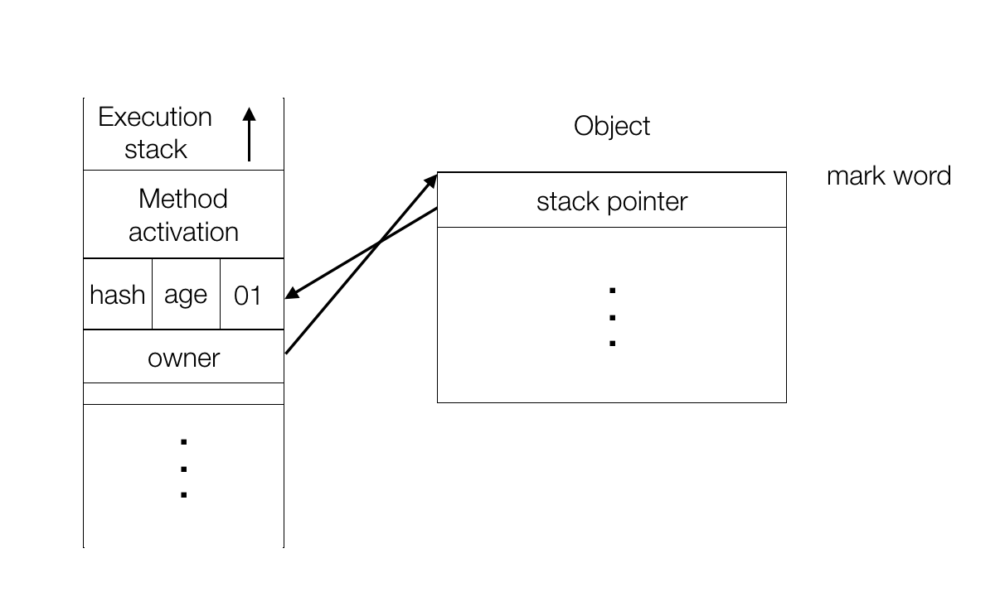
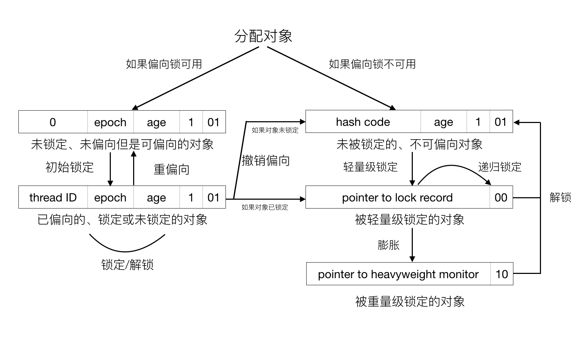

# 锁

## 锁优化

锁优化技术，如适应性自旋（Adaptive Spinning）、锁消除（Lock Elimination）、锁粗化（Lock Coarsening）、轻量级锁（Lightweight Locking）和偏向锁（Biased Locking），目的是在线程之间更高效地共享数据，解决竞争问题，提高程序的执行效率。

### 自旋锁与自适应自旋

**共享数据的锁定状态只会持续很短的一段时间**，而互斥同步中阻塞的实现对性能影响较大（挂起线程和恢复线程的操作都需要转入内核态中完成，给系统的并发性能带来很大压力）。如果**物理机器有一个以上的处理器**，能让两个或以上的线程同时并行执行，可以让后面请求锁的线程执行一个忙循环（自旋），保持占有处理器，看看持有锁的线程是否很快就会释放锁，这称之为自旋锁。

自旋锁对处理器数量有要求，虽然避免了线程切换开销，但是占用了处理器时间。如果锁被占用的时间很短，自旋等待的效果就会非常好，反之，如果锁被占用的时间很长，那么自旋的线程只会白白消耗处理器资源，带来性能上的浪费。因此，自旋等待的时间必须要有一定的限度，如果自旋超过了限定的次数仍然没有成功获得锁，就应当使用传统的方式去挂起线程。自旋次数的默认值是10次，可以使用参数-XX:PreBlockSpin来更改。

JDK 1.6引入了自适应的自旋锁，自适应意味着是指自旋的时间不固定，而是由前一次在同一个锁上的自旋时间及锁的拥有者的状态来决定（需要程序运行和性能监控信息）。如果在同一个锁对象上，自旋等待刚刚成功获得锁，并且持有锁的线程正在进行中，那么虚拟机就会认为这次自旋也很有可能再次成功，进而它将允许自旋等待持续相对更长的时间。另外，如果对于某个锁，自旋很少成功获得过，那在以后要获取这个锁时将可能省略掉自旋过程，以避免浪费处理器资源。

### 锁消除

锁消除是指虚拟机即时编译器在运行时，对一些代码上要求同步，但是被检测到不可能存在共享数据竞争的锁进行消除。

锁消除的主要判断依据来源于逃逸分析的数据支持，如果判断在一段代码中，堆上的所有数据都不会逃逸出去从而被其他线程访问到，就可以把它们当作栈上数据对待，认为它们是线程私有的，同步加锁无须进行。

### 轻量级锁

轻量级锁是JDK 1.6引入的，“轻量级”是相对于使用操作系统互斥量来实现的传统锁而言，轻量级锁并不是用来代替重量级锁的，它的本意是在没有多线程竞争的前提下，减少传统的重量级锁使用操作系统互斥量产生的性能消耗。

HotSpot虚拟机的对象头（Object Header）分为两部分信息，第一部分用于存储对象自身的运行时数据，如哈希码（HashCode）、GC分代年龄（Generational GC Age）等，这部分数据的长度在32位和64位的虚拟机中分别为32bit和64bit，官方称它为“Mark Word”，它是实现轻量级锁和偏向锁的关键。另外一部分用于存储指向方法区对象类型数据的指针，如果是数组对象的话，还会有一个额外的部分用于存储数组长度。

对象头信息是与对象自身定义的数据无关的额外存储成本，考虑到虚拟机的空间效率，Mark Word被设计成一个非固定的数据结构以便在极小的空间内存储尽量多的信息，它会根据对象的状态复用自己的存储空间。

在32位的HotSpot虚拟机中对象未被锁定的状态下，Mark Word的32bit空间中的25bit用于存储对象哈希码，4bit用于存储对象分代年龄，2bit用于存储锁标志位，1bit固定为0，在其他状态（轻量级锁定、重量级锁定、GC标记、可偏向）下对象的存储内容如下表：

| 存储内容 | 标志位 | 状态 |
| --- | --- | --- |
| 对象哈希码、对象分代年龄 | 01 | 未锁定 |
| 指向锁记录的指针 | 00 | 轻量级锁定 |
| 指向重量级锁的指针 | 10 | 膨胀（重量级锁定）|
| 空，不需要记录信息 | 11 | GC标记 |
| 偏向线程ID、偏向时间戳、对象分代年龄 | 01 | 可偏向 |

**轻量级锁的执行过程**：加锁过程，在代码进入同步块的时候，如果此同步对象没有被锁定（锁标志位为“01”状态），虚拟机首先将在当前线程的栈帧中建立一个名为锁记录（Lock Record）的空间，用于存储锁对象目前的Mark Word的拷贝（Displaced Mark Word），这时候线程堆栈与对象头的状态为：

然后，虚拟机将使用CAS操作尝试将对象的Mark Word更新为指向Lock Record的指针。如果这个更新动作成功了，那么这个线程就拥有了该对象的锁，并且对象Mark Word的锁标志（Mark Word的最后2bit）将转变为“00”，即表示此对象处于轻量级锁定状态，这时候线程堆栈与对象头的状态为：

如果这个更新操作失败了，虚拟机会首先检查对象的Mark Word是否指向当前线程的栈帧，如果只说明当前线程已经拥有了这个对象的锁，那就可以直接进入同步块继续执行，否则说明这个锁对象已经被其他线程抢占了。如果有两条以上的线程争用同一个锁，那轻量级锁就不再有效，要膨胀为重量级锁，锁标志的状态值变为“10”，Mark Word中存储的就是指向重量级锁（互斥量）的指针，后面等待锁的线程也要进入阻塞状态。

解锁过程，如果对象的Mark Word仍然指向这线程的锁记录，那就用CAS操作把对象当前的Mark Word和线程中复制的Displaced Mark Word替换回来，如果替换成功，整个同步过程就完成了。如果替换失败，说明有其他线程尝试过获取该锁，那就要在释放锁的同时，唤醒被挂起的线程。

轻量级锁能提升程序性能的依据是：对于绝大部分的锁，在整个同步周期内都是不存在竞争的。这是一个经验数据，如果没有竞争，轻量级锁使用CAS操作避免了使用互斥量的开销，但如果存在锁竞争，除了互斥量的开销外，还额外发生了CAS操作，因此在有竞争的情况下，轻量级锁会比传统的重量级锁更慢。

### 偏向锁

偏向锁是JDK 1.6引入的，目的是消除数据在无竞争情况下的同步原语，进一步提高程序的运行性能。

偏向锁的“偏”是指这个锁会偏向于第一个获得它的线程，如果在接下来的执行过程中，该锁没有被其他的线程获取，则持有偏向锁的线程将永远不需要再进行不同。

偏向锁原理：当锁对象第一次被线程获取的时候，虚拟机会把对象头中的标志位设为“01”，即偏向模式，同时使用CAS操作把获取到的这个锁的线程ID记录在对象的Mark Word之中，如果CAS操作成功，持有偏向锁的线程以后每次进入这个锁相关的同步块时，虚拟机都可以不再进行任何同步操作。当有另外一个线程去尝试获取这个锁时，偏向模式就宣告结束，根据锁对象目前是否处于被锁定状态，撤销偏向后恢复到未锁定或轻量级锁定的状态，后续的同步操作如轻量级锁那样执行。

偏向锁可以提高带有同步但无竞争的程序性能，是一个带有效益权衡（Trade Off）性质的优化。
