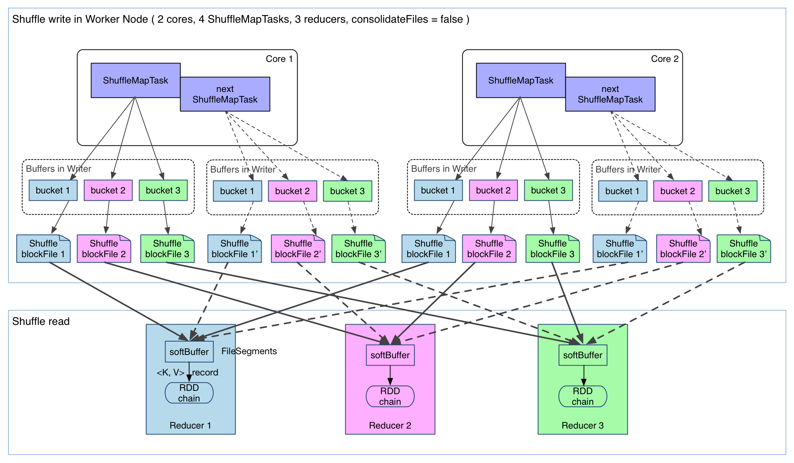
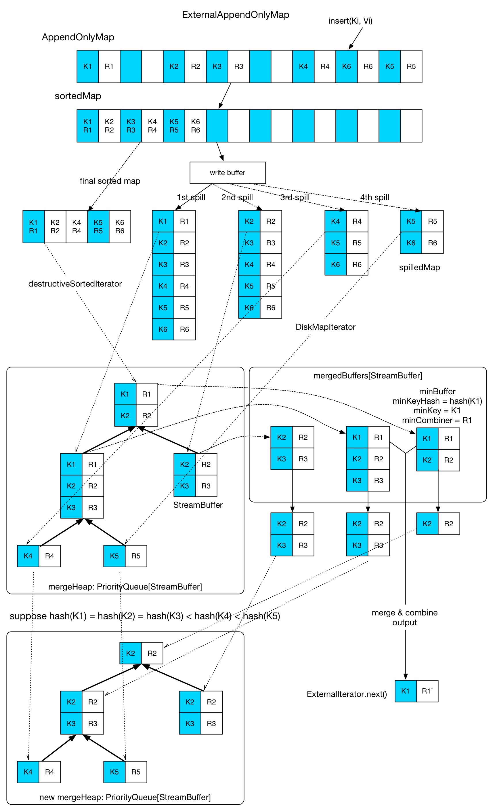

# Spark RDD #

RDD（Resilient Distributed Dataset，弹性分布式数据集）是Spark的基本抽象，表示已被分区、不可变并能被并行操作的数据集合。

RDD的类型包含任何java类型、scala类型、python类型或者自定义的类型。

`org.apache.rdd.RDD`：

+ `final def partitions: Array[Partition]：以数组形式返回RDD的分区列表，考虑checkpoint`
+ `abstract def compute(split: Partition, context: TaskContext): Iterator[T]`：抽象成员，计算指定分区，由具体子类实现
+ `final def dependencies: Seq[Denpendency[_]]`：返回RDD的依赖列表，考虑checkpoint
+ `val partitioner: Option[Partitioner]`：子类可以覆盖该属性来指定其分区方式
+ `final def preferredLocations(split: Partition): Seq[String]`：返回计算分区的最佳节点位置，考虑checkpoint

## 原理 ##

`org.apache.spark.rdd.RDD`类包含了所有RDD的基本操作，比如`map`、`filter`、`persist`。底层实现上，RDD有五个特性：

+ 分区列表：通过分区列表可以找到一个RDD中包含的所有分区及其所在地址
+ 计算每个分片的函数
+ RDD的依赖关系
+ 可选，键值对RDD的分区器
+ 可选，数据最佳计算位置，实现数据局部性（data locality）

Spark中的所有调度和执行都基于这些属性。

**分区**：在Spark中所有数据（输入、中间结果、输出）都被表示为分区，分区是数据的逻辑划分，是并行处理的基本单元，RDD就是分区的集合。底层存储方式决定RDD分区都是不可变的，每种RDD变换都会生成新的分区，另外，分区的不可变性有利于故障恢复。分区来源于HDFS，默认就是分布式的。分区具有位置感知，用于实现数据局部性。RDD的`mapPartitions()`接口可以同时获取分区所有数据，而不是一次一行，用于进行按分区操作。分区由指定的partitioner决定，默认使用HashPartitioner，也可以自定义partitioner。分区有利于快速查找。

**依赖关系**：RDD间的依赖关系分为窄依赖（narrow dependency）和宽依赖（wide dependency）。如果RDD的每个分区至多只被一个子RDD分区使用，则称之为窄依赖；若被多个子RDD分区依赖，则称之为宽依赖。不同的操作依据其特性，可能会产生不同的依赖，比如map产生窄依赖，join产生宽依赖。窄依赖在通过节点上以管道形式执行多条指令。宽依赖则需要所有父分区可用且通过类MapReduce操作在多个节点间进行shuffle操作。窄依赖的故障恢复效率高，对于一个存在宽依赖的RDD运算图，如果一个节点失败，可能导致某个RDD的一些依赖所有父RDD的分区丢失，进而需要完全重新计算。用户对RDD执行Action操作时，调度器根据这个RDD的逻辑执行图构建执行阶段的物理执行图。每个阶段（stage）包含尽可能多的产生窄依赖的可以管道化执行的变换操作，阶段的边界是宽依赖需要的shuffle操作，或者任何已经计算好的分区。然后，调度器加载任务去计算缺失的分区直到计算出目标RDD。

**惰性求值**：Spark中的所有变换操作都是惰性的，即不立即进行计算，仅仅记录对数据集应用的变换，仅当动作需要向driver program返回结果时才开始执行计算。每个RDD都可以获取其依赖RDD的列表，第一个RDD依赖的RDD为Nil，计算RDD前会先计算其依赖的RDD，这种运行链使得RDD支持惰性求值。Spark的每种操作都创建RDD特定子类的实例，map操作产生MappedRDD，flatMap操作产生FlatMappedRDD，这使得RDD可以记录变换中使用操作的类型。

+ HadoopRDD：使用旧MapReduce接口（`org.apache.hadoop.mapred`）读取Hadoop中数据
+ newHadoopRDD：使用新MapReduce接口（`org.apache.hadoop.mapreduce`）读取Hadoop中数据
+ JdbcRDD：通过JDBC连接执行SQL查询并读取数据
+ ShuffleRDD：shuffle操作生成的RDD
+ UnionRDD：
+ PartitionPruningRDD

**compute**：`compute()`是对RDD每个分区求值的函数，是RDD基类的一个抽象方法，RDD的每个子类都覆盖这个方法。`compute()`方法接收来自父RDD或者数据源的输入记录，执行`transformation()`的计算逻辑，然后输出记录。

### Spark Shuffle ###

在DAG阶段，以shuffle为界，划分stage，上游stage做map任务（ShuffleMapTask），每个map任务将计算结果数据分成多份，每一份对应到下游stage的每个partition中，并将其临时写到磁盘（即持久化，为了减少内存存储空间压力和容错），该过程叫做shuffle write；下游stage做reduce任务（ShuffleReduceTask），每个reduce任务通过网络拉取上游stage中所有map任务的指定分区结果数据，该过程叫做shuffle read，最后完成reduce的业务逻辑。

在map阶段，除了map的业务逻辑外，还有shuffle write的过程，这个过程划分并持久化数据，涉及到序列化、磁盘IO等耗时操作；在reduce阶段，除了reduce的业务逻辑外，还有shuffle read过程，这个过程读取并聚合数据，涉及到网络IO、反序列化等耗时操作。所以Spark Shuffle是一个涉及到CPU（序列化反序列化）、网络IO（跨节点数据传输）以及磁盘IO（Shuffle中间结果落地）的操作，整个Shuffle过程是及其昂贵的。

#### Spark Shuffle发展 ####

1. Spark 0.8及之前仅有Hash Shuffle
2. Spark 0.8.1为Hash Shuffle引入Consolidation（合并）机制
3. Spark 0.9引入ExternalAppendOnlyMap
4. Spark 1.1引入Sort Shuffle，默认仍未Hash Shuffle
5. Spark 1.2默认的Shuffle方式改为Sort Shuffle
6. Spark 1.4引入Tungsten-Sort Shuffle
7. Spark 1.6 Tungsten-Sort并入Sort Shuffle，实现自我感知选择最佳shuffle方式
8. Spark 2.0 删除Hash Shuffle

**Hash Shuffle**使用HashMap对数据进行聚合，不会对数据进行提前排序。在Shuffle Writer过程按照Hash的方式重组分区的数据，不进行排序，每个map端的任务为每个reduce端的任务生成一个文件，通常会产生大量的文件（M*R），伴随大量的随机磁盘IO操作与内存开销。在Shuffle Read过程，每个reduce端任务都会拉取所有map对应的那部分分区数据，executor会打开大量的文件描述符准备网络传输，另外，如果有combiner操作，那么它会把拉到的数据保存在一个Spark封装的哈希表（AppendOnlyMap）中进行合并。Hash Shuffle在小数据量下运行比较快，一旦数据量较大，基本就垮了。



上图有4个ShuffleMapTask要在同一个worker节点上运行，CPU核心数为2，可以同时运行两个任务。每个任务的执行结果（该阶段的finalRDD中某个分区包含的记录）被逐一写到本地磁盘，每个任务包含R个缓冲区，R为reducer个数（即下一个阶段中任务的个数），缓冲区被称为bucket，大小为`spark.shuffle.file.buffer.kb`，默认为32KB。

ShuffleMapTask的执行过程：先利用pipeline计算得到finalRDD中对应分区的记录，每得到一个记录就将其送到对应的bucket里（由`partitioner.partition(record.getKey())`决定）。每个bucket里的数据会不断被写到本地磁盘上，形成一个ShuffleBlockFile，简称FileSegment。之后的reducer会拉取属于自己的FileSegment，进入Shuffle read阶段。

缺点：

1. **产生的FileSegment过多** 每个ShuffleMapTask产生R个FileSegment，M个ShuffleMapTask就会产生M*R个文件，一般Spark作业的M和R都很大，因此磁盘上会存在大量的数据文件
2. **缓冲区占用内存空间大** 每个ShuffleMapTask需要打开R个bucket，M个ShuffleMapTask就会产生M\*R个bucket。虽然一个ShuffleMapTask结束后，对应的缓冲区可以被回收，但一个worker节点上同时存在的bucket个数可以达到cores * R个（一般worker同时可以运行cores个ShuffleMapTask），占用的内存空间也就达到cores\*R\*32 KB，对于8核1000个reducer来说，占用内存就是256MB。

**FileConsolidation**通过文件合并，中间文件的生成方式修改为每个执行单位（一个executor中的执行单位等于core个数除以每个task所需的core数）为每个reduce端的任务生成一个文件，将文件个数从M*R修改为K\*R（K为执行单位数），通过`spark.shuffle.consolidateFiles`参数设置是否启用Consolidate机制。


在一个core上连续执行的ShuffleMapTasks可以共用一个输出文件ShuffleFile。先执行完的ShuffleMapTask形成ShuffleBlock i，后执行的ShuffleMapTask可以将输出数据直接追加到ShuffleBlock i后面，形成ShuffleBlock i'，每个ShuffleBlock被称为FileSegment。下一个阶段的reducer只需要fetch整个ShuffleFile就行了。这样，每个worker持有的文件数降为cores*R。

**ExternalAppendOnlyMap**AppendOnlyMap是Spark基于开放寻址法中的二次探测法实现的Map，只能添加数据，不能删除，使用数组中的两个位置来存储键值对，即`a[i]=keyi, a[i+i]=valuei`。当`spark.shuffle.spill=true`时会启用ExternalAppendOnlyMap，默认为true，为false时启用`AppendOnlyMap`，ExternalAppendOnlyMap在内存维护了一个SizeTrackingAppendOnlyMap（继承自AppendOnlyMap），当该Map元素数超过一定值时就spill到磁盘，ExternalAppendOnlyMap其实是维护了一个内存Map（currentMap）和多个diskMap（spillMap），最后对临时文件进行合并。

**Sort Shuffle**在Shuffle Write过程，会按照分区id以及键对记录进行排序，将所有分区的数据写在同一个文件中，该文件中的记录先是按照分区id排序，然后每个分区内部是按照键进行排序存放，map任务运行期间会顺序写每个分区的数据，并通过一个索引文件记录每个分区的大小和偏移量。这样，每个map任务一次只打开两个文件描述符，一个写数据，一个写索引，减轻了Hash Shuffle文件描述符过多的问题，存在K个执行单位时最多一次性打开2*K个文件描述符。在Shuffle Read过程，reduce任务拉取数据做combine时不再采用HashMap，而是使用ExternalAppendOnlyMap，该数据结构在做combine时，如果内存不足，会spill到磁盘，避免大数据情况下的OOM。

**Tungsten**将数据用二进制方式存储，引入堆外内存空间和新的内存管理模型，直接在序列化的二进制数据上排序而不是在Java对象上。在排序过程中，提供cache-efficient sorter，使用一个8字节的指针，把排序转化成了一个指针数组的排序，极大的优化了排序性能。Unsafe Shuffle有几个限制，shuffle阶段不能有聚合（aggregate）操作，分区数不能超过（2^24-1），这是可编码的最大分区id，输出不能排序。由于堆外内存的管理基于JDK Unsafe API，故Tungsten Based Shuffle也被称为Unsafe Shuffle。

从Spark 1.6.0开始，Spark把Unsafe Shuffle合并到Sort Shuffle中，如果检测到满足Unsafe Shuffle条件会自动采用Unsafe Shuffle，否则采用Sort Shuffle。

从Spark 2.0.0开始，Spark把Hash SHuffle移除，目前Spark中只有Sort Shuffle一种Shuffle。

#### Shuffle Read ####

1. reducer在shuffle的时候向driver的MapOutputTrackerMaster查询ShuffleMapTask输出的数据位置，每个ShuffleMapTask完成时会将FileSegment的存储位置信息汇报给MapOutputTrackerMaster。

2. 当父阶段的所有ShuffleMapTask结束后再拉取记录。获得的FileSegment先在内存中做缓冲，所以一次拉取的FileSegments总大小不能太大，Spark规定这个缓冲界限（SoftBuffer）不能超过`spark.reduce.maxMbInFlight`，默认大小为48MB。一个SoftBuffer里面一般包含多个FileSegment，如果某个FileSegment特别大的话，这一个就可以填满甚至超过SoftBuffer的界限。

3. 边拉取记录边处理。使用可以聚合的数据结构，比如HashMap，每获得（从缓冲的FileSegment中反序列化出来）一个键值对，直接将其放进HashMap里面，如果HashMap已经存在相应的键，那么直接进行聚合操作（`func(hashMap.get(key), Value)`），并将`func`的结果重新put到HashMap中。

4. 刚fetch来的FileSegment存放在SoftBuffer缓存区，经过处理后的数据放在内存+磁盘上（可以设置只用内存）。如果`spark.shuffle.spill=false`就只用内存，使用AppendOnlyMap，否则使用内存+磁盘，对应ExternalAppendOnlyMap。

#### Shuffle HashMap ####

HashMap是Spark Shuffle Read过程中频繁使用的、用于聚合的数据结构。Spark设计了两种：一种是全内存的AppendOnlyMap，另一种是内存+磁盘的ExternalAppendOnlyMap。

##### AppendOnlyMap #####

AppendOnlyMap是一个采用开放寻址法（二次探测）处理哈希冲突的仅支持追加操作且为追加操作优化的哈希表实现，仅支持追加操作是指从不移除键，但是键对应的值可以修改。


实现原理就是创建一个Object数组，键值相邻存放。如果Array的利用率达到70%，就扩张一倍，并将所有键值对重新放置到新的位置。

AppendOnlyMap的`destructiveSortedIterator(): Iterator[(K, V)]`方法返回数组中排序后的键值对。实现原理是：先将所有键值对移动到数组前端，并使得每个键值对占据一个位置（原来占两个），然后直接调用`Arrays.sort()`排序。

##### ExternalAppendOnlyMap #####



ExternalAppendOnlyMap内部包含一个AppendOnlyMap，shuffle过程中拉取的键值对先插入到AppendOnlyMap中。当AppendOnlyMap快被装满时检查一下内存剩余空间是否可以扩展，如果可以就直接在内存中扩展，不能扩展的话就对AppendOnlyMap排序，将其包含的所有记录保存（spill）到磁盘，每次spill完在磁盘上生成一个SpilledMap文件，然后重新创建一个AppendOnlyMap。最后一个键值对记录插入到AppendOnlyMap后，表示所有shuffle拉取的记录都放到了ExternalAppendOnlyMap中，但是不表示记录都被处理完，因为每次插入的时候，新来的记录只与AppendOnlyMap中的记录进行聚合，并不是与所有记录进行聚合。因此当需要聚合的最终结果时，需要对AppendOnlyMap和所有的SpilledMap文件进行全局的归并聚合。

全局归并聚合的流程：先将AppendOnlyMap中的记录进行排序，形成SortedMap，然后利用DestructiveSortedInterator和DiskMapIterator分别从SortedMap和各个SpilledMap文件中读出一部分数据（StreamBuffer）放到MergeHeap里。StreamBuffer里包含的记录需要有相同的`hash(key)`。MergeHeap是指使用堆排序不断提取出`hash(firstRecord.Key)`相同的StreamBuffer，并将其一个个放入MergeBuffer中，放入的时候与已经存在于MergeBuffer中的StreamBuffer进行merge-combine，第一个被放入MergeBuffer的StreamBuffer被称为minBuffer，minKey就是minBuffer中第一条记录的键。当merge-combine的时候，与minKey相同的记录被聚合到一起，然后输出。整个merge-combine在MergeBuffer中结束后，StreamBuffer剩余的记录随着StreamBuffer重新进入MergeHeap。一旦某个StreamBuffer在merge-combine后变为空（包含的记录都被输出了），那么会使用DestructiveSortedIterator或DiskMapIterator重新装填`hash(key)`相同的记录，然后再重新进入MergeHeap。

整个insert-merge-aggregate的过程有三点需要注意：

+ 内存剩余空间检测：Spark规定executor中`spark.shuffle.memoryFraction*spark.shuffle.safeFraction`的空间（默认是0.3*0.8）可用于ExternalOnlyAppendMap。这些空间是由在executor上同时运行的所有ShuffleReadTask共享的。每个executor持有一个`ShuffleMemoryMap: HashMap[threadId, occupiedMemory]`来监控每个ShuffleReadTask中ExternalOnlyAppendMap占用的内存量。每当AppendOnlyMap要扩展时，都会计算ShuffleMemoryMap持有的所有ShuffleReadTask中的AppendOnlyMap已占用的内存+扩展后的内存是否会大于内存限制，大于就会将AppendOnlyMap保存到磁盘。前1000条记录进入AppendOnlyMap的时候不会启动spill检测，需要扩展时就直接在内存中扩展。
+ AppendOnlyMap大小估计：Spark使用了一个粗略的估算算法计算AppendOnlyMap占用的内存空间，核心思想是利用AppendOnlyMap中每次insert-aggregate记录后结果的大小变化及一共插入的记录数来估算大小。
+ Spill过程：在将记录保存到磁盘上时，会建立一个buffer缓冲区，大小仍为`spark.shuffle.file.buffer.kb`，默认是32KB。另外，由于serializer也会分配缓冲区用于序列化和反序列化，所以如果一次序列化的记录过多，缓冲区会变得很大。Spark限制每次序列化的记录个数为`spark.shuffle.spill.batchSize`，默认是10000

#### Shuffle调优 ####

`repartition()`、`join()`、`cogroup()`和`*By`或者`*ByKey`类型的操作都会产生shuffle。

+ 尽量减少shuffle次数。join前对两个RDD使用相同的分区方式，executor内存可以存储数据集时也可以使用广播变量
+ 必要时主动shuffle，通常用于改变并行度，提高后续分布式运行速度
+ groupByKey某些情况下可以被reducebykey代替
+ reduceByKey某些情况下可以被 aggregatebykey代替
+ flatMap-join-groupBy某些情况下可以被cgroup代替
+ 使用treeReduce和treeAggregate替换reduce和aggregate。reduce和aggregate为一次性聚合，数据量较大时shuffle量太大，而treeReduce和treeAggregate是分批聚合，更为保险。

## 创建RDD ##

有两种方式创建RDD：一是并行化driver program中存在的集合，一是引用外部存储系统中的数据集。

`SparkContext.parallelize()`用于创建并行集合。禁止使用`parallelize(Seq())`创建空RDD，使用emptyRDD表示不带分区的RDD，或者使用`parallelize(Seq[T]())`创建带有空分区的类型为T的RDD。

```scala
def parallelize[T](seq: Seq[T], numSlices: Int = defaultParallelism)(implicit arg0: ClassTag[T]): RDD[T]
```

Spark支持从Hadoop兼容的外部存储系统创建RDD，且支持文本文件、Sequence文件以及其他Hadoop InputFormat。

使用`SparkContext.textFile()`读取文本文件，每行对应结果RDD中的一个元素。参数path是文件路径，参数minPartitions是建议结果RDD的最小分区数，默认为defaultMinPartitions，而在SparkContext中defaultMinPartitions定义为`def defaultMinPartitions: Int = math.min(defaultParallelism, 2)`，表明其不会大于2。

```scala
def textFile(path: String, minPartitions: Int = defaultMinPartitions): RDD[String]
```

使用Spark读取文件时需要注意以下几点：

+ 如果使用本地文件系统路径，文件必须存在于worker节点的相同路径
+ Spark所有基于文件的输入方法支持目录、压缩文件和通配符
+ Spark默认为文件的每个HDFS块（默认为128M）创建一个分区，可以通过minPartitions设置更大的分区数目，分区数目不能比块数目小

使用`SparkContext.wholeTextFiles()`读取包含多个小文本文件的目录，结果RDD中的元素为`(filename, content)`的形式，分区由data locality决定，可能导致分区过少，可以通过minPartitions参数控制分区数目

```scala
def wholeTextFiles(path: String, minPartitions: Int = defaultMinPartitions): RDD[(String, String)]
```

使用`SparkContext.sequenceFile[K,V]()`读取Sequence文件，K和V分别是文件中键和值的类型，应该是Hadoop Writable接口的子类，比如`IntWritable`、`Text`。

```scala
def sequenceFile[K, V](path: String, minPartitions: Int = defaultMinPartitions): RDD[(K, V)]
def sequenceFile[K, V](path: String, keyClass: Class[K], valueClass: Class[V]): RDD[(K, V)]
def sequenceFile[K, V](path: String, keyClass: Class[K], valueClass: Class[V], minPartitions: Int): RDD[(K, V)]
```

## RDD操作 ##

RDD支持两种操作：transformation和action。RDD transformation从已经存在的RDD创建新的RDD，新RDD是惰性求值的，RDD action则向driver program返回结果或把结果写入外部系统。

### Transformation ###

通用RDD transformation：

|名称|描述|函数参数类型|
|---|---|---|
|`filter(func)`|返回满足条件的元素组成的RDD|`(T) => Boolean`|
|`map(func)`|对 RDD中的每个元素应用函数func，返回新元素组成的RDD|`(T) ⇒ U`|
|`mapPartitions(func)`|对RDD的每个分区应用函数func，返回新元素组成的RDD。如果在map过程中需要频繁创建额外的对象，那么mapPartitions效率比map高很多|`(Iterator[T]) => Iterator[U]`|
|`mapPartitionsWithIndex(func)`|与 mapPartitions类似，传入的参数多了一个分区的索引值。preservesPartitioning表示是否保留原partitioner，一般为false，除非RDD为键值对RDD并且func不修改键值|`(Int, Iterator[T]) => Iterator[U]`|
|`flatMap(func)`|对RDD中的每个元素应用func并将结果扁平化，返回新元素组成的RDD|`(T) => TraversableOnce[U]`|
|`pipe(command)`|调用shell命令处理RDD||
|`groupBy(func)`|根据给定的func对RDD中元素进行分组，返回一个键值对RDD，键由对RDD中元素应用f后返回的值组成，值为对应相同键的所有元素组成的序列，每组内元素是无序的|`(T) => K`|
|`glom()`|将类型为T的RDD的一个分区内的所有元素合并到一个数组中，返回一个Array[T]类型的RDD||
|`keyBy(func)`|返回一个键值对RDD，键为对元素应用函数func后的返回值|`(T) => K`|
|`sortBy(func)`|对RDD排序|`(T) ⇒ K`|
|`repartition(numPartitions)`|通过shuffle操作，重新设置RDD的分区数，可以增加或减少分区。如果只需减少分区，应使用coalesce来避免shuffle操作||
|`coalesce(numPartitions)`|减少RDD分区||
|`distinct()`|对RDD去重||
|`union(otherRDD)`|合并两个RDD||
|`cartesian(otherRDD)`|计算两个RDD的笛卡尔积，返回一个键值对RDD，其中键为这个RDD中的元素，值otherRDD中的元素||
|`intersection(otherRDD)`|计算两个RDD的交集||
|`subtract(otherRDD)`|计算两个RDD的差集，返回所有存在这个RDD中同时不在otherRDD中的元素组成的新RDD||
|`zip(otherRDD)`|对两个RDD执行zip操作，返回一个键值对RDD，其中键是这个RDD中的元素，值是otherRDD中对应位置处的元素，这两个RDD必须有相同的分区并且每个分区的元素数目也必须相同||
|`zipPartitions()`|||
|`zipWithIndex()`|对RDD中的元素和它们对应的索引执行zip操作||
|`zipWithUniqueId()`|对RDD中的元素和一个唯一ID执行zip操作||

键值对RDD transformation：

|名称|描述|函数参数签名|
|---|---|---|
|`keys()`|获取所有键||
|`values()`|获取所有值||
|`groupByKey()`|将键值对RDD按照键分组，返回`(K,Iterable[V])`类型的RDD||
|`reduceByKey(func)`|将键值对RDD按照键使用函数func进行归约|`(V, V) => V`|
|`aggregateByKey(zeroValue)(seqOp, combOp, [numPartitions])`|使用指定的函数及初始值 (类型默认零值)，先对每个分区的值按照键进行归约操作，然后对所有分区的结果再进行归约操作|seqOp：`(U, V) => U` combOp：`(U, U) => U`|
|`combineByKey()`|||
|`foldByKey()`|使用函数func和零值聚合每个键对应的值，零值可能多次加到结果上，但是不能改变结果值||
|`sortByKey()`|对键值对RDD根据键进行排序||
|`join(otherRDD)`|对两个键值对RDD进行join操作，结果RDD中元素类型为`(k, (v1, v2))`， v1、v2分别为两个RDD中k对应的值，这个操作将在集群中进行hashjoin||
|`leftOuterJoin(otherRDD)`|对两个键值对RDD进行left outer join操作||
|`rightOuterJoin(otherRDD)`|对两个键值对RDD进行right outer join操作||
|`fullOuterJoin(otherRDD)`|对两个键值对RDD进行full outer join操作||
|`cogroup()`|组合多个RDD中相同键对应的值，返回`(K, (Iterable[V1], Iterable[V2]))`类型的RDD||
|`mapValues(func)`|对键值对RDD中的值应用函数func|`(V) => U`|
|`flatMapValues(func)`|对键值对RDD中的值应用函数func，对结果数组进行扁平化后和键结合|`(V) => TraversableOnce[U]`|
|`repartitionAndSortWithinPartitions()`|||

### Action ###

## 其他 ##

### RDD持久化 ###

Spark的一个很重要的能力就是将数据持久化（或称为缓存），在多个操作间都可以访问这些持久化的数据。当持久化一个RDD时，每个节点会将本节点计算的数据块存储到内存，在该数据上的其他action操作将直接使用内存中的数据。这样会让以后的action操作计算速度加快。缓存保障迭代算法和交互使用快速进行的重要手段。

RDD可以使用`persisit()`或`cache()`进行持久化。数据将会在第一次action操作时进行计算，并在各个节点的内存中缓存。Spark缓存具有容错机制，如果一个缓存的RDD的某个分区丢失了，Spark将按照原来的计算过程，自动重新计算并进行缓存。

另外，每个持久化的RDD可以使用不同的存储级别进行缓存，比如，持久化到磁盘、已序列化的Java对象持久化到内存、跨节点复制。存储级别通过向`persist()`传入一个StorageLevel对象设置，`cache()`方法是使用默认存储级别（StorageLevel.MEMORY_ONLY）的快捷方法。

|存储级别|描述|
|---|---|
|MEMORY_ONLY|将RDD以Java对象的形式存储在JVM中，如果内存不能容纳RDD，一些分区将不会缓存，而是使用的时候再计算，这是默认级别|
|MEMORY_AND_DISK|将RDD以Java对象形式存储在JVM中，如果内存不能容纳RDD，将无法存储的分区存储到磁盘上，使用的时候从磁盘读取|
|MEMORY_ONLY_SER|将RDD以序列化Java对象的形式存储（每个分区对应一个字节数组）。一般比java对象更节省空间，尤其是使用一个快速序列化器时，但是需要更多CPU|
|MEMORY_AND_DISK_SER|和MEMORY_ONLY_SER相似，但是无法存储的分区将不再存储到磁盘而是使用的时候再进行计算|
|DISK_ONLY|仅将RDD分区存储到磁盘|
|MEMORY_ONLY_2、MEMORY_AND_DISK_2等|和上面的级别相同，只是在两个集群节点上复制每个分区|
|OFF_HEAP|和MEMORY_ONLY_SER相似，但是在堆外内存（off-heap）存储数据，需要启用off-heap|

Spark也会在shuffle操作中自动持久化一些中间数据，以避免shuffle过程中节点失败后重计算整个输入。

Spark存储级别表示在内存和CPU效率之间的权衡，建议基于以下几点选择合适的存储级别：

+ 如果可以使用默认存储级别（MEMORY_ONLY），就使用默认级别。MEMORY_ONLY是CPU效率最高的，对RDD的操作将运行地非常快
+ 如果不能使用默认存储级别，尝试使用MEMORY_ONLY_SER和一个快速序列化库，MEMORY_ONLY_SER是空间效率最高的，并且仍然可以快速获取
+ 除非计算数据集的函数很耗时（重计算比从磁盘读取要慢），否则不要存储到磁盘
+ 如果需要快速故障恢复，使用复制存储级别。所有存储级别通过重计算丢失数据来提供完整的故障恢复，但是复制存储级别可以一直对RDD执行操作而不需要重计算丢失的分区。

Spark自动监控每个节点上缓存的使用情况，并以LRU方式删除旧的数据分区。使用`RDD.unpersist()`可以手动移除RDD缓存。
