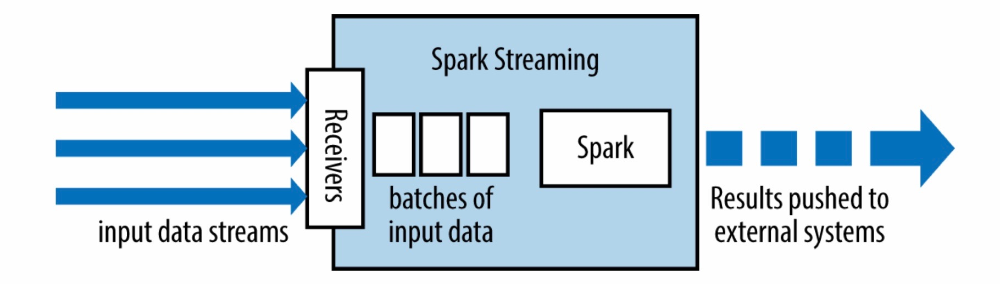
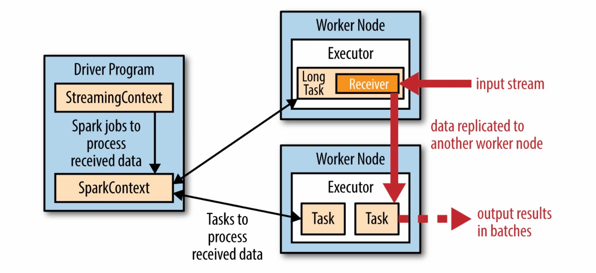

# Spark Streaming #

Spark Streaming是Spark core API的一个扩展，采用微批处理提供可扩展的、高吞吐的、容错的实时流处理功能。

数据从Kafka、Flume、TCP等源输入，使用`map`、`reduce`、`join`和`window`等高级函数表示的算法进行处理，最后，结果输出到文件系统、数据库以及仪表盘。

术语：

+ 离散流：
+ 批数据：
+ 时间片：或批处理时间间隔
+ 窗口长度
+ 滑动时间间隔

## 架构 ##



Spark Streaming从多种数据源接收数据，并将它们按照时间片分成批数据。每个时间片的开始创建一个新的批数据，在这个时间片内到达的数据都被添加到这个批数据，这个时间片结束后，对应的批数据停止增加，时间片的大小由参数`batch interval`决定，`batch interval`一般在500ms到几秒之间，由开发人员设置。每个输入批数据构成一个RDD，并使用Spark作业处理生成其它RDD，处理结果以批数据的形式推送到外部系统。



对于每个输入源，Spark Streaming启动Receiver（在应用executor中运行的任务，负责收集输入数据并保存为RDD），它们接收输入数据并向其它executor复制以支持容错，数据存储在executor的内存中，Driver Program中的StreamingContext之后周期性的运行Spark作业处理这些数据并和前面时间片的RDD结合。

## DStream ##

Spark Streaming使用DStream（discretized stream，离散流）抽象表示连续的数据流，从Kafka、Flume等源接收的输入数据流，或对输入DStream应用Transformation处理后的数据流。DStream在Spark Streaming内部由一组时间序列上连续的RDD表示，每个RDD包含数据流某个时间片内的所有数据。对DStream的任何操作都转换为对这些RDD的操作并由Spark Engine执行。

Input DStream表示从Kafka、Flume等源接收的输入数据流，每个Input DStream（除文件系统）都和一个Receiver对象关联，Receiver对象从源接收数据并保存在Spark内存中进行处理。

Spark Streaming提供两类数据流来源：

+ 基本来源：可通过StreamingContext API直接使用的源
+ 高级来源：通过额外的类可以使用的源，使用时需要添加依赖

如果需要在流应用中并行接收多个数据流，需要创建多个Input DStream，这会创建多个Receiver并行接收多个数据流。但是，Spark worker/executor是一直运行的进程，占用一个给Spark Streaming应用分配的CPU核心，所以必须确保Spark Streaming应用有足够的CPU核心来运行Receiver及处理接收的数据。在本地运行Spark Streaming程序时，将master URL设置为`local[n]`，n大于需运行的Receiver数目。同理，在集群运行Spark Streaming程序时，分配的CPU核心数必须大于Receiver的数目。

### Receiver ##

## 输入源 ##

### 基本来源 ###

### 高级来源 ###

### 自定义来源 ###

## 容错性 ##

DStreaming的容错性和RDD的相同：只要输入数据的一个副本有效，Spark Streaming便能通过RDD Lineage（血统）重新计算它之后的任何状态。接收的数据默认在两个节点上复制，所以Spark Streaming可以承受单个worker失败。仅仅使用Lineage在重新计算应用开始时的数据时耗时较长，为此Spark Streaming提供了checkpoint机制。checkpoint周期性的将状态保存到可靠的文件系统，恢复丢失的数据时，Spark Streaming仅仅只需回溯到上个checkpoint。


## checkpoint ##

有两类数据需要定期checkpoint：

+ 元数据：将流计算信息保存到HDFS等有容错性的存储，用于从Streaming应用的driver所在节点的失败中恢复。元数据主要包含配置、DStream操作和未完成的批数据。
+ 数据：将生成的RDD保存到可靠存储中，对于合并多个批次中的数据的有状态transformation是必须的

使用有状态的transformation的应用和需要从driver失败中恢复的应用必须使用checkpoint。

## 应用开发 ##

## API ##

### Transformation ###

DStream的transformation可以分成两类：

+ 无状态的transformation：每个批数据的处理不依赖于前面的批数据，包括`map()`、`filter()`、`reduceByKey()`
+ 有状态的transformation：使用前面的批数据或中间结果来处理当前批数据，包括窗口操作和`updateStateByKey()`

#### 无状态的transformation ####

| 函数名称 | 描述 | 函数参数签名 |
|-|-|-|-|
| `map(mapFunc)` | 对DStream中的每个元素应用函数并返回结果组成的DStream | `(T) -> U` |
| `mapPartitions(mapPartFunc)` | 对DStream中的每个RDD应用`mapPartitions()`，返回新DStream | `(Iterator[T]) => Iterator[U]` |
| `mapValues(mapValuesFunc)` | 对DStream中每个键值对的值应用`mapValuesFunc`函数，而不改变键，返回新DStream | `(V) => U`|
| `mapWithState()` | 对DStream中的每个键值对||
| `flatMap()` | 对DStream中的每个元素应用函数并返回迭代器包含的所有元素组成的DStream | ds.flatMap(x => x.split(" ")) | f: T -> Iterable[U] |
| `filter()` | 返回DStream中满足条件的元素组成的DStream | ds.filter(x => x != 1) | f: T -> Boolean |
| `repartition()` | 改变DStream的分区数目 | ds.repartition(10) | |
| `reduce()` ||||
| `slice()` ||||
| `union()` ||||
| `count()` ||||
| `countByValue()` ||||
| `transform()` |通过对原DStream中的每个RDD应用转换函数，创建一个新的DStream|||
| `transformWith()`|||
| `cogroup()` ||||
| `combineByKey()` ||||
| `groupByKey()` ||||
| `reduceByKey()` ||||
| `flatMapValues()` ||||
| `join()` ||||
| `fullOuterJoin()` ||||
| `leftOuterJoin()` ||||
| `rightOuterJoin()` ||||
| `reduceByKey()` | 合并每个批数据中相同键对应的值 | ds.reduceByKey((x, y) => x + y) | f: T, T -> T |
| `groupByKey()` | 收集每个批数据中相同键对应的值 | ds.groupByKey() | |

`transform()`通过对原DStream中的每个RDD应用转换函数，创建一个新的DStream，可以用于实现DStream API中没有提供的操作，比如将DStream中的每个RDD和一个特定的RDD进行join操作来实现黑名单过滤功能。可以动态的更改关联的RDD，传入`transform()`的函数每个时间片内都会被求值，使用此时函数中关联的RDD指向的数据。

+ `def transform[U](transformFunc: (RDD[T], Time) ⇒ RDD[U])(implicit arg0: ClassTag[U]): DStream[U]`

+ `def transform[U](transformFunc: (RDD[T]) ⇒ RDD[U])(implicit arg0: ClassTag[U]): DStream[U]`

`transformWith()`对两个DStream中的每对RDD应用转换函数，创建一个新的DStream。

+ `def transformWith[U, V](other: DStream[U], transformFunc: (RDD[T], RDD[U], Time) ⇒ RDD[V])(implicit arg0: ClassTag[U], arg1: ClassTag[V]): DStream[V]`

+ `def transformWith[U, V](other: DStream[U], transformFunc: (RDD[T], RDD[U]) ⇒ RDD[V])(implicit arg0: ClassTag[U], arg1: ClassTag[V]): DStream[V]`

Spark Streaming中的join操作：

+ 使用`join()`进行两个DStream的join操作：对于每个时间片，将两个DStream中的对应RDD进行join操作，返回结果RDD组成的新DStream，也可以通过`leftOuterJoin()`、`rightOuterJoin()`、`fullOuterJoin()`执行对应的关联操作
+ 使用`transform()`进行DStream和特定RDD的join操作

#### 有状态的transformation ####

主要包含两种：窗口操作和`updateStateByKey()`，窗口操作作用在固定时间间隔的滑动窗口上，`updateStateByKey()`用于在事件间保存每个键的状态。

另外，使用有状态的transformation时需要在StreamingContext中设置checkpoint。

窗口操作通过合并多个批数据的结果处理比StreamingContext的时间片长的时间间隔内的数据。所有的窗口操作都需要两个参数：窗口长度和滑动时间间隔，这两个参数的值都必须是StreamingContext时间片的整数倍。窗口长度设置每个窗口内批数据的数目，滑动时间间隔默认为时间片，设置新DStream多久处理一次数据。

| 名称 | 描述 | 函数参数类型 |
|---|---|--|
| `window(windowDuration, slideDuration=timeInterval)` | 合并滑动窗口中的数据，返回新RDD组成的DStream | |
| `countByWindow(windowDuration, slideDuration)` | 统计每个每个窗口中包含元素的数目，返回新DStream |
| `countByValueAndWindow(windowDuration, slideDuration)` | 统计每个窗口中各个元素的数目，返回新DStream |
| `reduceByWindow(reduceFunc, windowDuration, slideDuration)` | 对滑动窗口中的所有元素应用reduce操作，返回新DStream | `(T,T) => T` |
| `reduceByKeyAndWindow(reduceFunc, windowDuration, slideDuration)` | 对滑动窗口中的所有键值对应用reduceByKey操作，返回新DStream | `(V,V) => V` |
| `groupByKeyAndWindow(windowDuration, slideDuration=timeInterval)` | 对滑动窗口中的所有键值对应用groupByKey操作，返回新DStream |

窗口长度和滑动时间间隔都是`Duration`类型，可以通过`Milliseconds(ms)`、`Seconds(s)`、`Minutes(m)`等辅助对象或`Durations`中的方法`milliseconds(ms)`、`seconds(s)`、`minutes(m)`创建。

`reduceByWindow()`、`reduceByKeyAndWindow()`操作支持invReduceFunc参数为reduceFunc的反函数，删除滑出滑动窗口外的时间片中数据的效果，减少`reduce`操作的重复计算，性能更好。

`updateStateByKey()`用于保持任意状态，并用新数据不断更新。使用这个操作需要两个步骤：

1. 定义状态：状态可以是任意数据类型
2. 定义状态更新函数：指定如何根据状态当前值和新数据更新状态

```scala
def updateStateByKey[S](updateFunc: (Seq[V], Option[S]) ⇒ Option[S])(implicit arg0: ClassTag[S]): DStream[(K, S)]

// updateFunc函数示例
val addFunc = (currValues: Seq[Int], prevValueState: Option[Int]) => {
    // 当前批次单词的总数
    val currCount = currValues.sum
    // 已累加的值
    val prevCount = prevValueState.getOrElse(0)
    // 返回累加后的结果，是一个Option[Int]类型
    Some(currCount + prevCount)
}
```

对于每个时间片，Spark Streaming都会对所有存在的键应用状态更新函数，无论它们是否在新数据中出现。如果状态更新函数返回None，那么键值对将会被忽略。

### Output Operation ###

| 名称 | 描述 |
|---|---|---|
| `print(num=10)` |输出DStream中每个RDD的前num个元素，默认为10|
| `saveAsTextFiles(prefix, suffix="")` |将DStream中的每个RDD保存为文本文件，使用字符串表示RDD中的元素，每个时间片对应文件的名称为“prefix-TIME_IN_MS.suffix”|
| `saveAsObjectFiles(prefix, suffix="")` |将DStream中的每个RDD中的数据序列化后保存到Sequence文件中，每个时间片对应文件的名称为“prefix-TIME_IN_MS.suffix”|
| `saveAsHadoopFiles(prefix, suffix="")` |将DStream中的每个RDD保存到Hadoop文件中，每个时间片对应文件的名称为“prefix-TIME_IN_MS.suffix”|
| `foreachRDD(foreachFunc)` |对DStream中的每个RDD应用foreachFunc函数|

`foreachRDD()`中函数参数签名有两种：

+ `(RDD[T], Time) ⇒ Unit`
+ `(RDD[T]) ⇒ Unit`

## 优化 ##

## 原理 ##
