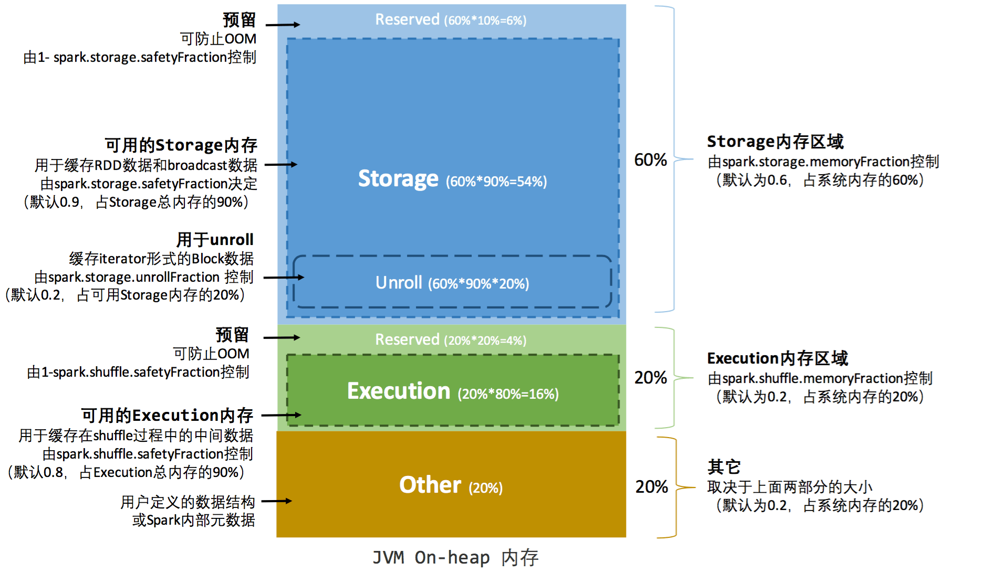
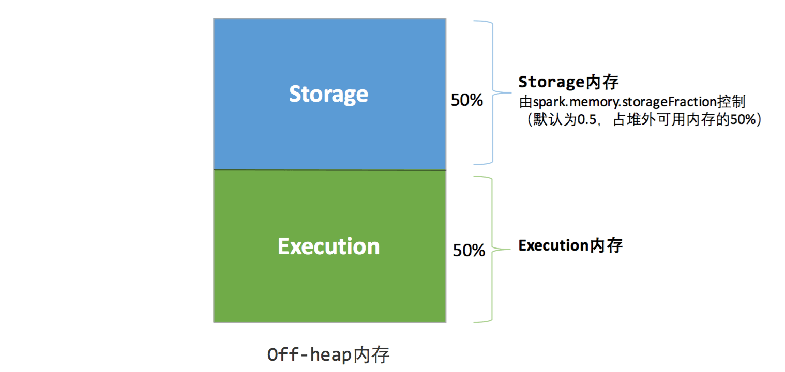
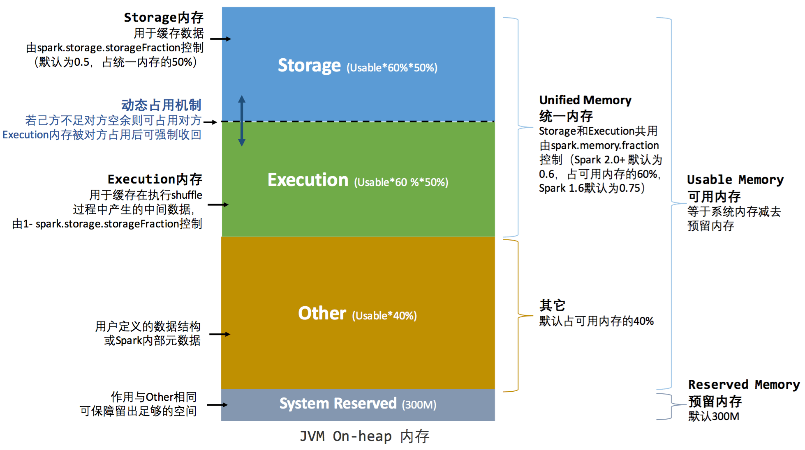
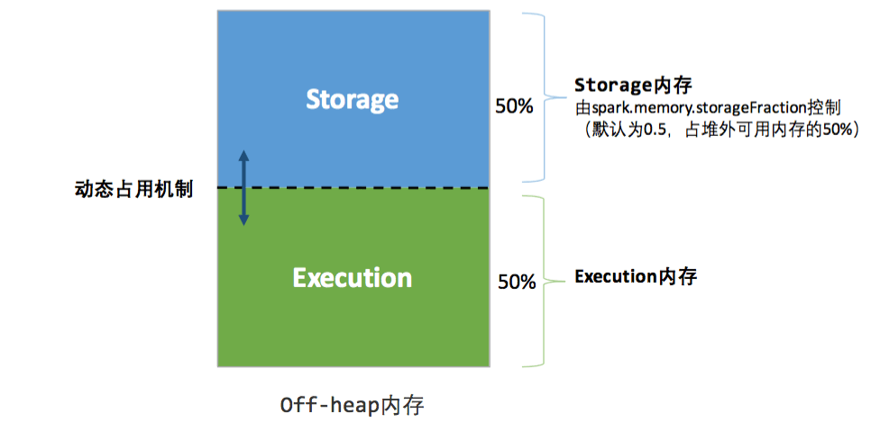
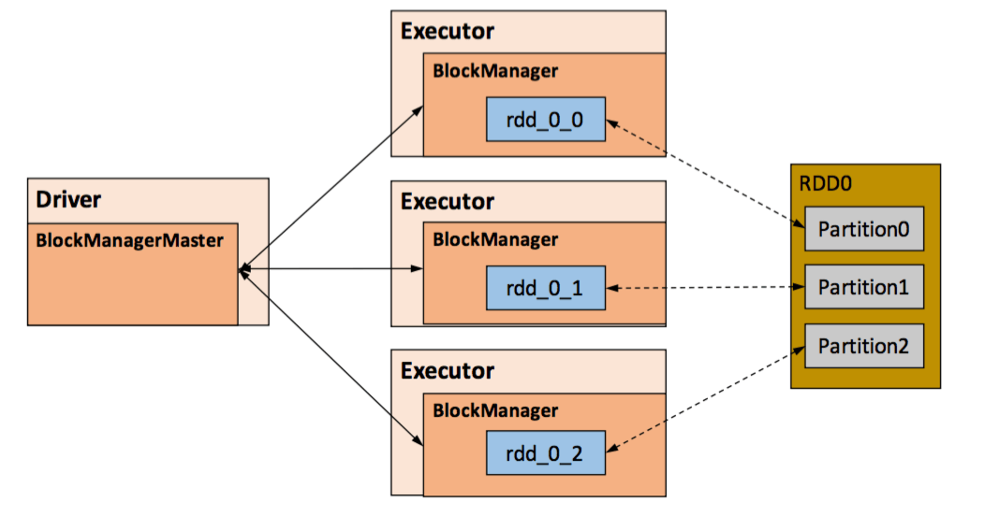
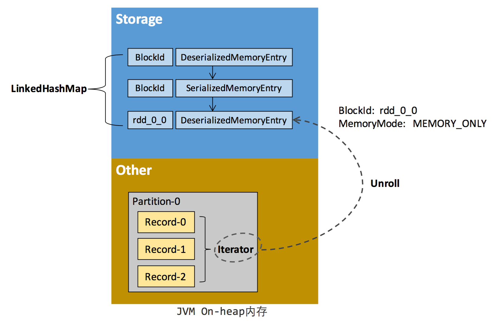

# Spark 内存管理

## Executor内存管理

Spark Executor的内存管理建立在JVM的内存管理之上，对JVM的堆空间进行了更为详细的分配。

### 堆内内存（On-heap Memory）

堆内内存大小由参数`--executor-memory`或`spark.executor.memory`配置，Executor内运行的并发任务共享堆内内存。

对象实例占用内存的申请和释放都由JVM完成，Spark对堆内内存的管理是一种逻辑上的“规划式”的管理，只能在申请后和申请前记录这些内存，不能精确控制堆内内存的申请和释放。

申请内存：

1. Spark在代码中new一个对象实例
2. JVM从堆内内存分配空间，创建对象并返回对象引用
3. Spark保存该对象的引用，记录该对象占用的内存

释放内存：

1. Spark记录该对象释放的内存，删除该对象的引用
2. 等待JVM的垃圾回收机制释放该对象占用的堆内内存

对象实例可以以序列化的方式存储，序列化的过程是将对象转换为二进制字节流，即将非连续空间的链式存储转化为连续空间或块存储，在访问时则需要进行序列化的逆过程，将字节流转化为对象，序列化的方式可以节省存储空间，但增加了存储和读取时候的计算开销。

对于Spark中序列化的对象，由于是字节流的形式，其占用的内存大小可直接计算，而对于非序列化的对象，其占用的内存是通过周期性地近似估算而得，即并不是每次新增的数据项都会计算一次占用的内存大小，这种方法降低了时间开销但是有可能误差较大，导致某一时刻的实际内存远远超出预期。另外，被Spark标记为释放的对象实例，很可能实际上并没有被JVM回收，导致实际可用的内存小于Spark记录的可用内存。所以Spark并不能准确记录实际可用的堆内内存，从而无法完全避免内存溢出的异常。

## 堆外内存（Off-heap Memory）

Spark引入堆外内存，利用JDK Unsafe API直接在工作节点的系统内存中开辟空间，存储经过序列化的二进制数据，减少不必要的内存开销以及频繁的GC扫描和回收，优化内存使用，提高shuffle时排序的效率。

堆外内存可以被精确地申请和释放，序列化数据占用的空间可以被精确计算，相比堆内内存来说降低了管理的难度，也降低了误差。

堆外内存由参数`spark.memory.offHeap.enabled`参数启用，并由`spark.memory.offHeap.size`参数设定堆外空间的大小。除了没有其他空间，堆外内存与堆内内存的划分方式相同，所有运行中的并发任务共享存储内存和执行内存。

## 内存管理接口

MemoryManager是管理存储内存和执行内存的统一接口，同一个Executor内的任务都调用这个接口的方法来申请或释放内存。

```scala
// 申请存储内存
def acquireStorageMemory(blockId: BlockId, numBytes: Long, memoryMode: MemoryMode): Boolean
// 申请展开内存
def acquireUnrollMemory(blockId: BlockId, numBytes: Long, memoryMode: MemoryMode): Boolean
// 申请执行内存
def acquireExecutionMemory(numBytes: Long, taskAttemptId: Long, memoryMode: MomoryMode): Long
// 释放存储内存
def releaseStorageMemory(numBytes: Long, memoryMode: MemoryMode): Unit
// 释放执行内存
def releaseExecutionMemory(numBytes: Long, taskAttemptId: Long, memoryMode: MemoryMode): Unit
// 释放展开内存
def releaseUnrollMemory(numBytes: Long, memoryMode: MemoryMode): Unit
```

参数MemoryMode指定是在堆内还是堆外进行操作。

## 内存空间分配

MemoryManager的具体实现上，Spark 1.6之前采用的是静态内存管理（Static Memory Manager），1.6及之后采用统一内存管理（Unified Memory Manager）。可以通过配置`spark.memory.useLegacyMode`参数启用静态内存管理。

### 静态内存管理



对于静态内存管理，存储内存、执行内存和其他内存的大小在Spark应用程序运行期间均为固定的，可以在应用启动前进行配置。

可用的堆内内存大小计算公式：

```code
可用的存储内存 = systemMaxMemory * spark.storage.memoryFraction * spark.storage.safetyFraction;
可用的执行内存 = systemMaxMemory * spark.shufffle.memoryFraction * spark.shuffle.safetyFraction
```

systemMaxMemory取决于当前JVM堆内内存的大小，safetyFraction参数的意义在于在逻辑上预留出1-safetyFraction大小的预留区域，降低因实际内存超出当前预设范围而导致OOM的风险（对于非序列化对象的内存采样估算会产生误差），这个预留区域仅仅是一种逻辑上的规划，在具体使用时Spark并没有区别对待，也是交给了JVM去管理。



堆外内存只有存储内存和执行内存，可用的执行内存和存储内存直接由参数`spark.memory.storageFraction`决定，由于堆外内存占用的空间可以被精确计算，故无需再设定保险区域。

### 统一内存管理

静态内存管理实现简单，但是如果不熟悉Spark的存储机制，或没有根据具体的数据规模和计算任务做相应的配置，很容易造成存储内存和执行内存中的一方剩余大量的空间，而另一方却早早被占满，不得不淘汰或移出旧的内容以存储新的内容。

Spark 1.6之后引入了统一内存管理机制，存储内存和执行内存共享同一块空间，可以动态占用对方的空闲区域。





动态占用机制：

+ 设定基本的存储内存和执行内存区域（`spark.storage.storageFraction`），该设定确定了双方各自拥有的空间范围
+ 双方的空间都不足时，则存储到硬盘，若己方空间不足而对方空余时，可借用对方的空间（存储空间不足是指不足以放下一个完整的Block）
+ 执行内存的空间被对方占用后，可让对方将占用的部分转存到硬盘，然后归还借用的空间
+ 存储内存的空间被对方占用后，无法让对方归还，因为需要考虑Shuffle过程中的很多因素，实现复杂

## 存储内存管理

Task在启动之初读取一个分区时，会先判断这个分区是否已经被持久化，如果没有则需要检查Checkpoint或按照血统重新计算。如果一个RDD上要执行多次行动，可以在第一次行动中使用persist或cache方法，在内存或磁盘中持久化或缓存这个RDD，从而在后面的行动时提升计算速度。堆内和堆外存储内存的设计可以对缓存RDD时使用的内存做统一的规划和管理。

### RDD的持久化机制



RDD的持久化由Spark的Storage模块负责，实现了RDD与物理存储的解耦合，Storage模块负责管理Spark在计算过程中产生的数据，将在内存或磁盘、在本地或远程存取数据的功能封装起来。在具体实现时Driver端和Executor端的Storage模块构成了主从式的架构，即Driver端的BlockManager为Master，Executor端的BlockManager为Slave。Storage模块在逻辑上以Block为基本存储单位，RDD的每个Partition经过处理后唯一对应一个Block（BlockId格式为rdd_RDD-ID_PARTITION-ID）。Master负责整个Spark应用程序的Block的元数据信息的管理和维护，而Slave需要将Block的更新等状态上报到Master，同时接收Master命令（如新增或删除一个RDD）。

RDD持久化时有7中不同的存储级别：

存储级别是以下5个变量的组合：

```scala
private class StorageLevel (
  private var _useDisk: Boolean, // 磁盘
  private var _useMemory: Boolean, // 堆内内存
  private var _useOffHeap: Boolean, // 堆外内存
  private var _deserialized: Boolean, // 是否为非序列化
  private var _replication: Int = 1 // 副本个数
)
```

存储级别从三个纬度定义了RDD的分区（也即Block）的存储方式：

+ 存储位置：磁盘、堆内内存、堆外内存
+ 存储形式：Block缓存到存储内存后，是否为非序列化的形式
+ 副本数量：大于1时需要远程冗余备份到其他节点

### RDD缓存的过程

RDD在缓存到存储内存之前，分区中的数据一般以迭代器（Iterator）的数据结构来访问，通过迭代器可以获取分区中每一条序列化或者非序列化的数据项，这些数据项的对象实例在逻辑上占用了JVM堆内内存的其他部分的空间，同一分区的不同数据项在空间上并不连续。

RDD在缓存到存储内存之后，分区被转换成Block，数据项在堆内或堆外存储内存中占用一块连续的空间。Spark将分区由不连续的存储空间转换为连续存储空间的过程称为展开（Unroll）。Block有序列化和非序列化两种存储格式，具体以哪种方式取决于该RDD的存储级别。非序列化的Block以一种DeserializedMemoryEntry的数据结构定义，用一个数组存储所有的对象实例，序列化的Block则以SerializedMemoryEntry的数据结构定义，用字节缓冲区（ByteBuffer）来存储二进制数据。每个Executor的Storage模块用一个链式的Map结构（LinkedHashMap）来管理堆内和堆外存储内存中所有的Block对象的实例，对这个LinkedHashMap新增和删除间接记录了这个内存的申请和释放。

因为不能保证存储空间可以一次容纳迭代器中的所有数据，当前的计算任务在展开时要向MemoryManager申请足够的展开空间来临时占位，空间不足则展开失败，空间足够时可以继续进行，对于序列化的分区，其所需的展开空间可以直接累加计算，一次申请。而非序列化的分区则要在遍历记录的过程中一次申请，即每读取一条数据项，采样估算其所需的展开空间并进行申请，空间不足时可以中断，释放已占用的展开空间。如果最终展开成功，当前分区所占用的展开空间被转换为正常的缓存RDD的存储空间。



在静态内存管理时，Spark在存储内存中专门划分了一块展开空间，其大小是固定的，统一内存管理时则没有对展开空间进行特别区分，当存储空间不足时会根据动态占用机制进行处理。

### 淘汰和落盘

由于同一个Executor所有的计算任务共享有限的存储内存空间，当有新的Block需要缓存但是剩余空间不足且无法动态占用时，就要对LinkedHashMap中的旧Block进行淘汰，而被淘汰的Block如果其存储级别中同时包含存储到磁盘的要求，则要对其进行落盘，否则直接删除该Block。

存储内存的淘汰规则为：

+ 被淘汰的旧Block要与新Block的MemoryMode相同，即同属于堆外或堆内内存
+ 新旧Block不能属于同一个RDD，避免循环淘汰
+ 旧Block所属RDD不能处于被读状态，避免引发一致性问题
+ 遍历LinkedHashMap中Block，按照最近最少使用（LRU）的顺序淘汰，直到满足新Block所需的空间

落盘的流程为：如果存储级别符合_useDisk为true的条件，再根据_deserialized判断是否是非序列化的形式，若是则对其进行序列化，最后将数据存储到磁盘，在Storage模块中更新其信息。

## 执行内存管理

### 多任务间内存分配

Executor内运行的任务同样共享执行内存，Spark用一个HashMap结构保存了任务到内存耗费的映射。每个任务可占用的执行内存大小的范围为1/2N~1/N，其中N为当前Executor内正在运行的任务的个数。每个任务在启动之时，要向MemoryManager请求申请最少为1/2N的执行内存，如果不能被满足要求则该任务被阻塞，直到有其他任务释放了足够的执行内存，该任务才可以被唤醒。

### Shuffle的内存占用

执行内存主要用来存储任务在执行Shuffle时占用的内存，Shuffle是按照一定规则对RDD数据重新分区的过程，Shuffle的Write和Read阶段对执行内存的使用：

+ Shuffle Write：
  1. 若在map端选择普通的排序方式，会采用ExternalSorter进行外排，在内存中存储数据时主要占用堆内执行空间
  2. 若在map端选择Tungsten的排序方式，则采用ShuffleExternalSorter直接对以序列化形式存储的数据排序，在内存中存储数据时可以占用堆外或堆内执行空间，取决于用户是否开启了堆外内存以及堆外执行内存是否足够

+ Shuffle Read
  1. 在对reduce端的数据进行聚合时，要将数据交给Aggregator处理，在内存中存储数据时占用堆内执行空间
  2. 如果需要进行最终结果排序，则要将再次将数据交给ExternalSorter处理，占用堆内执行空间

在ExternalSorter和Aggregator中，Spark使用AppendOnlyMap的哈希表在堆内执行内存中存储数据，但在Shuffle过程中所有数据并不能都保存到该哈希表中，当这个哈希表占用的内存会进行周期性地采样估算，当其大到一定程度，无法再从MemeoryManager申请到新的执行内存时，Spark就会将其全部内容存储到磁盘文件中，这个过程被称为溢存（Spill）溢存到磁盘的文件最后会被归并（Merge）。

Spark会根据Shuffle的情况来自动选择是否采用Tungsten排序，Tungsten采用的页式内存管理机制建立在MemoryManager之上，即Tungsten对执行内存的使用进行了进一步的抽象，这样在Shuffle过程中无需关心数据具体存储在堆内还是堆外，每个内存页用一个MemoryBlock来定义，并用Object obj和long offset这两个变量统一标识一个内存页在系统内存中的地址，堆内的MemoryBlock是以long型数组的形式分配的内存，其obj的值为是这个数组的对象引用，offset是long型数组的在JVM中初始偏移地址，两者配合使用可以定位这个数组在堆内的绝对地址；堆外的MemoryBlock是直接申请到的内存块，其obj为null，offset是这个内存块在系统内存中的64位绝对地址。Spark使用MemoryBlock巧妙地将堆内和堆外内存页统一抽象封装，并用页表（pageTable）管理每个Task申请到的内存页。

Tungsten页式管理下的所有内存用64位的逻辑地址表示，由页号和页内偏移量组成：

+ 页号：占13位，唯一标识一个内存页，Spark在申请内存页之前要先申请空闲页号
+ 页内偏移量：占51位，是在使用内存页存储数据时，数据在页内的偏移地址

有了统一的寻址方式，Spark可以用64位逻辑地址的指针定位到堆内或堆外的内存，整个Shuffle Write排序的过程只需要对指针进行排序，并且无需反序列化，整个过程非常高效，对于内存访问效率和CPU使用效率带来明显提升。

Spark 的存储内存和执行内存有着截然不同的管理方式：对于存储内存来说，Spark 用一个 LinkedHashMap 来集中管理所有的 Block，Block 由需要缓存的 RDD 的 Partition 转化而成；而对于执行内存，Spark 用 AppendOnlyMap 来存储 Shuffle 过程中的数据，在 Tungsten 排序中甚至抽象成为页式内存管理，开辟了全新的 JVM 内存管理机制。
